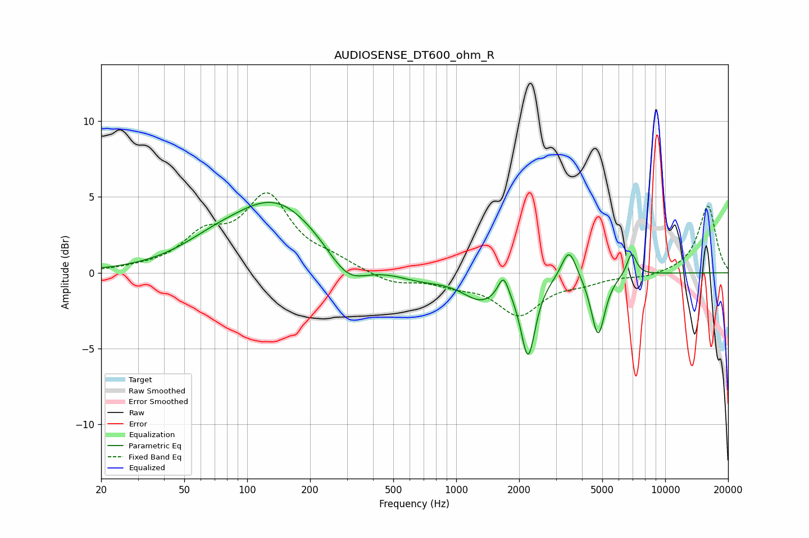

# AUDIOSENSE_DT600_ohm_R
See [usage instructions](https://github.com/jaakkopasanen/AutoEq#usage) for more options and info.

### Parametric EQs
Apply preamp of -4.7 dB when using parametric equalizer.

|   # | Type    |   Fc (Hz) |    Q |   Gain (dB) |
|-----|---------|-----------|------|-------------|
|   1 | Peaking |        67 | 0.92 |         0.8 |
|   2 | Peaking |       137 | 0.64 |         4.6 |
|   3 | Peaking |       302 | 1.46 |        -2   |
|   4 | Peaking |       665 | 1.23 |        -0.5 |
|   5 | Peaking |      1323 | 1.48 |        -1.7 |
|   6 | Peaking |      1682 | 5.63 |         1.4 |
|   7 | Peaking |      2208 | 4.13 |        -5.1 |
|   8 | Peaking |      3466 | 3.96 |         2.1 |
|   9 | Peaking |      4775 | 4.26 |        -4.1 |
|  10 | Peaking |      6913 | 6    |         1.5 |

### Fixed Band EQs
When using fixed band (also called graphic) equalizer, apply preamp of **-5.4 dB** (if available) and set gains manually with these parameters.

|   # | Type    |   Fc (Hz) |    Q |   Gain (dB) |
|-----|---------|-----------|------|-------------|
|   1 | Peaking |        31 | 1.41 |         0.2 |
|   2 | Peaking |        62 | 1.41 |         2.2 |
|   3 | Peaking |       125 | 1.41 |         4.8 |
|   4 | Peaking |       250 | 1.41 |         0.7 |
|   5 | Peaking |       500 | 1.41 |        -0.7 |
|   6 | Peaking |      1000 | 1.41 |        -0.6 |
|   7 | Peaking |      2000 | 1.41 |        -2.6 |
|   8 | Peaking |      4000 | 1.41 |        -0.5 |
|   9 | Peaking |      8000 | 1.41 |        -0.3 |
|  10 | Peaking |     16000 | 1.41 |         4.4 |

### Graphs

