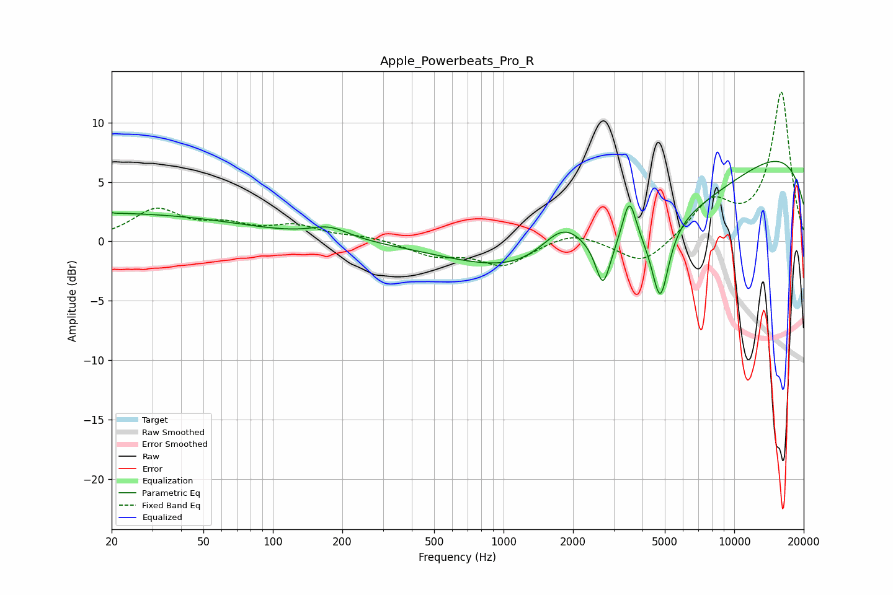

# Apple_Powerbeats_Pro_R
See [usage instructions](https://github.com/jaakkopasanen/AutoEq#usage) for more options and info.

### Parametric EQs
Apply preamp of -6.8 dB when using parametric equalizer.

|   # | Type    |   Fc (Hz) |    Q |   Gain (dB) |
|-----|---------|-----------|------|-------------|
|   1 | Peaking |        20 | 5.8  |         2.1 |
|   2 | Peaking |        20 | 0.24 |         2.3 |
|   3 | Peaking |        20 | 5.98 |        -2   |
|   4 | Peaking |       176 | 1.68 |         1   |
|   5 | Peaking |      1819 | 1.43 |         3.3 |
|   6 | Peaking |      2699 | 4.57 |        -3.8 |
|   7 | Peaking |      3305 | 0.25 |        -6.9 |
|   8 | Peaking |      3512 | 4.78 |         3.8 |
|   9 | Peaking |      4780 | 3.84 |        -6.2 |
|  10 | Peaking |     10000 | 0.18 |         9.2 |

### Fixed Band EQs
When using fixed band (also called graphic) equalizer, apply preamp of **-12.7 dB** (if available) and set gains manually with these parameters.

|   # | Type    |   Fc (Hz) |    Q |   Gain (dB) |
|-----|---------|-----------|------|-------------|
|   1 | Peaking |        31 | 1.41 |         2.5 |
|   2 | Peaking |        62 | 1.41 |         1.1 |
|   3 | Peaking |       125 | 1.41 |         1.2 |
|   4 | Peaking |       250 | 1.41 |         0.4 |
|   5 | Peaking |       500 | 1.41 |        -1.1 |
|   6 | Peaking |      1000 | 1.41 |        -2   |
|   7 | Peaking |      2000 | 1.41 |         0.9 |
|   8 | Peaking |      4000 | 1.41 |        -2.1 |
|   9 | Peaking |      8000 | 1.41 |         3.2 |
|  10 | Peaking |     16000 | 1.41 |        12.5 |

### Graphs

