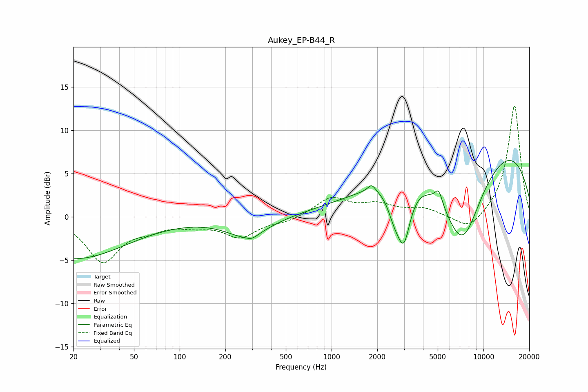

# Aukey_EP-B44_R
See [usage instructions](https://github.com/jaakkopasanen/AutoEq#usage) for more options and info.

### Parametric EQs
Apply preamp of -6.6 dB when using parametric equalizer.

|   # | Type    |   Fc (Hz) |    Q |   Gain (dB) |
|-----|---------|-----------|------|-------------|
|   1 | Peaking |        20 | 0.4  |        -4.8 |
|   2 | Peaking |       279 | 1.02 |        -2.3 |
|   3 | Peaking |       299 | 4.38 |        -0.4 |
|   4 | Peaking |      1378 | 1    |        -0.3 |
|   5 | Peaking |      1836 | 5.88 |         0.8 |
|   6 | Peaking |      2585 | 3.05 |        -2.7 |
|   7 | Peaking |      2991 | 3.18 |        -6.3 |
|   8 | Peaking |      5075 | 5.52 |         1.7 |
|   9 | Peaking |      7232 | 0.84 |       -13   |
|  10 | Peaking |      8379 | 0.21 |        11.1 |

### Fixed Band EQs
When using fixed band (also called graphic) equalizer, apply preamp of **-12.9 dB** (if available) and set gains manually with these parameters.

|   # | Type    |   Fc (Hz) |    Q |   Gain (dB) |
|-----|---------|-----------|------|-------------|
|   1 | Peaking |        31 | 1.41 |        -5   |
|   2 | Peaking |        62 | 1.41 |        -1   |
|   3 | Peaking |       125 | 1.41 |        -0.7 |
|   4 | Peaking |       250 | 1.41 |        -2.2 |
|   5 | Peaking |       500 | 1.41 |        -0.5 |
|   6 | Peaking |      1000 | 1.41 |         2.2 |
|   7 | Peaking |      2000 | 1.41 |         1.3 |
|   8 | Peaking |      4000 | 1.41 |         0.9 |
|   9 | Peaking |      8000 | 1.41 |        -1.8 |
|  10 | Peaking |     16000 | 1.41 |        13   |

### Graphs

