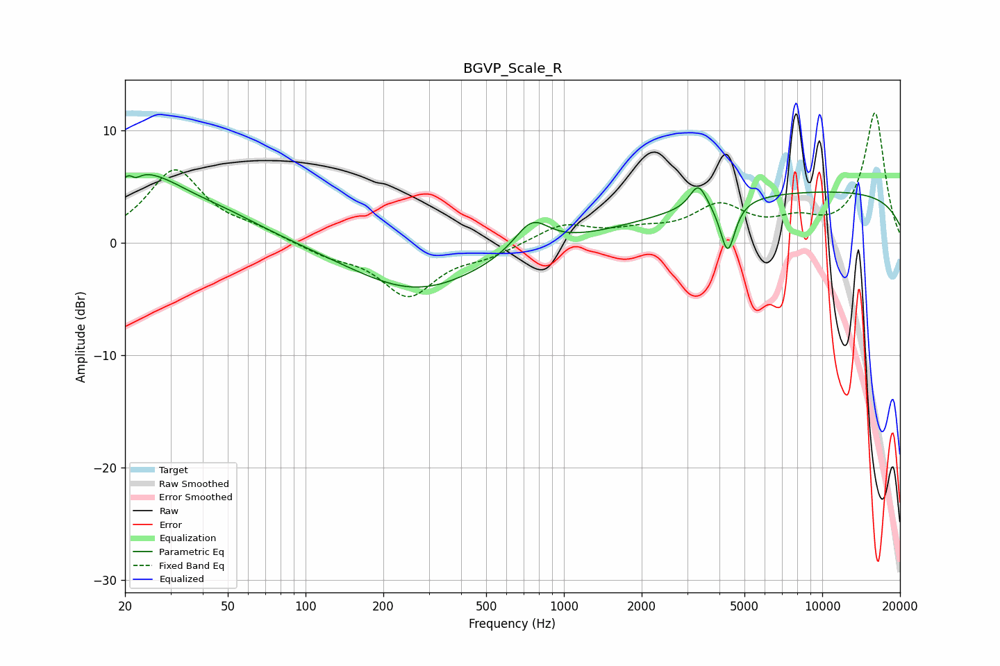

# BGVP_Scale_R
See [usage instructions](https://github.com/jaakkopasanen/AutoEq#usage) for more options and info.

### Parametric EQs
Apply preamp of -6.2 dB when using parametric equalizer.

|   # | Type    |   Fc (Hz) |    Q |   Gain (dB) |
|-----|---------|-----------|------|-------------|
|   1 | Peaking |        21 | 5.66 |         3.1 |
|   2 | Peaking |        22 | 5.83 |        -3.3 |
|   3 | Peaking |        22 | 1.55 |         1.9 |
|   4 | Peaking |        30 | 0.62 |         5.4 |
|   5 | Peaking |        36 | 1.32 |        -0.8 |
|   6 | Peaking |       269 | 0.56 |        -4.3 |
|   7 | Peaking |       751 | 2.11 |         2.8 |
|   8 | Peaking |      3314 | 4.41 |         2.2 |
|   9 | Peaking |      4305 | 4.9  |        -4.6 |
|  10 | Peaking |     10000 | 0.18 |         4.6 |

### Fixed Band EQs
When using fixed band (also called graphic) equalizer, apply preamp of **-11.6 dB** (if available) and set gains manually with these parameters.

|   # | Type    |   Fc (Hz) |    Q |   Gain (dB) |
|-----|---------|-----------|------|-------------|
|   1 | Peaking |        31 | 1.41 |         6.4 |
|   2 | Peaking |        62 | 1.41 |         0.9 |
|   3 | Peaking |       125 | 1.41 |        -1   |
|   4 | Peaking |       250 | 1.41 |        -4.6 |
|   5 | Peaking |       500 | 1.41 |        -0.9 |
|   6 | Peaking |      1000 | 1.41 |         1.6 |
|   7 | Peaking |      2000 | 1.41 |         0.8 |
|   8 | Peaking |      4000 | 1.41 |         3   |
|   9 | Peaking |      8000 | 1.41 |         1.5 |
|  10 | Peaking |     16000 | 1.41 |        11.5 |

### Graphs

