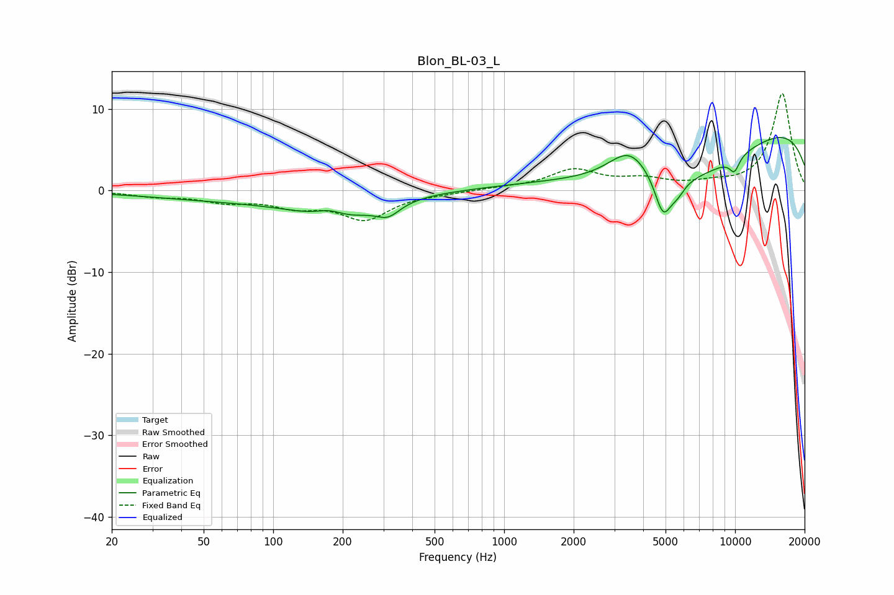

# Blon_BL-03_L
See [usage instructions](https://github.com/jaakkopasanen/AutoEq#usage) for more options and info.

### Parametric EQs
Apply preamp of -6.6 dB when using parametric equalizer.

|   # | Type    |   Fc (Hz) |    Q |   Gain (dB) |
|-----|---------|-----------|------|-------------|
|   1 | Peaking |        77 | 0.35 |        -1.2 |
|   2 | Peaking |       176 | 2.16 |         1.2 |
|   3 | Peaking |       192 | 0.89 |        -2.9 |
|   4 | Peaking |       315 | 2.79 |        -1.5 |
|   5 | Peaking |      3503 | 1.49 |         4.2 |
|   6 | Peaking |      4881 | 3.78 |        -4.8 |
|   7 | Peaking |      5638 | 0.36 |        -9.3 |
|   8 | Peaking |      5639 | 4.21 |        -1.3 |
|   9 | Peaking |      9165 | 0.18 |        11.1 |
|  10 | Peaking |      9929 | 5.58 |        -1.8 |

### Fixed Band EQs
When using fixed band (also called graphic) equalizer, apply preamp of **-12.0 dB** (if available) and set gains manually with these parameters.

|   # | Type    |   Fc (Hz) |    Q |   Gain (dB) |
|-----|---------|-----------|------|-------------|
|   1 | Peaking |        31 | 1.41 |        -0.6 |
|   2 | Peaking |        62 | 1.41 |        -1.2 |
|   3 | Peaking |       125 | 1.41 |        -1.6 |
|   4 | Peaking |       250 | 1.41 |        -3.3 |
|   5 | Peaking |       500 | 1.41 |        -0.2 |
|   6 | Peaking |      1000 | 1.41 |         0.3 |
|   7 | Peaking |      2000 | 1.41 |         2.4 |
|   8 | Peaking |      4000 | 1.41 |         1.2 |
|   9 | Peaking |      8000 | 1.41 |         0.6 |
|  10 | Peaking |     16000 | 1.41 |        11.9 |

### Graphs

