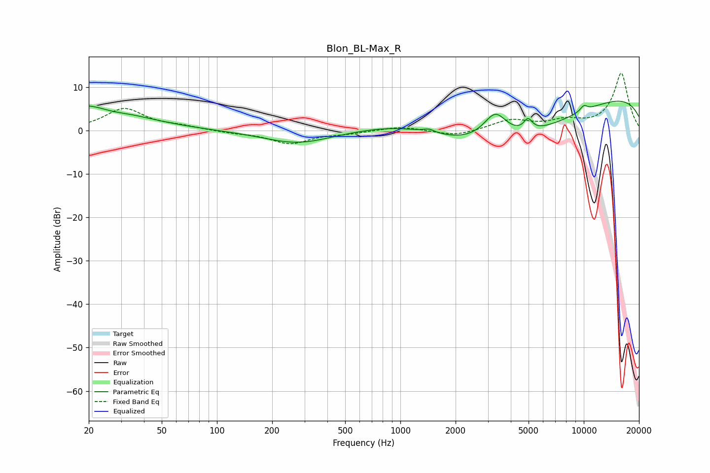

# Blon_BL-Max_R
See [usage instructions](https://github.com/jaakkopasanen/AutoEq#usage) for more options and info.

### Parametric EQs
Apply preamp of -6.9 dB when using parametric equalizer.

|   # | Type    |   Fc (Hz) |    Q |   Gain (dB) |
|-----|---------|-----------|------|-------------|
|   1 | Peaking |        20 | 0.59 |         6.2 |
|   2 | Peaking |        26 | 1.7  |        -1   |
|   3 | Peaking |       276 | 0.76 |        -3   |
|   4 | Peaking |      1061 | 0.57 |         3.4 |
|   5 | Peaking |      1433 | 4.61 |         0.8 |
|   6 | Peaking |      3292 | 2.08 |         6.8 |
|   7 | Peaking |      3613 | 0.35 |       -10.9 |
|   8 | Peaking |      4965 | 6    |         2.6 |
|   9 | Peaking |     10000 | 0.18 |         9.5 |
|  10 | Peaking |     10000 | 6    |         1.3 |

### Fixed Band EQs
When using fixed band (also called graphic) equalizer, apply preamp of **-13.3 dB** (if available) and set gains manually with these parameters.

|   # | Type    |   Fc (Hz) |    Q |   Gain (dB) |
|-----|---------|-----------|------|-------------|
|   1 | Peaking |        31 | 1.41 |         5   |
|   2 | Peaking |        62 | 1.41 |         0.8 |
|   3 | Peaking |       125 | 1.41 |        -0.5 |
|   4 | Peaking |       250 | 1.41 |        -2.9 |
|   5 | Peaking |       500 | 1.41 |        -0.6 |
|   6 | Peaking |      1000 | 1.41 |         1   |
|   7 | Peaking |      2000 | 1.41 |        -1.3 |
|   8 | Peaking |      4000 | 1.41 |         2.3 |
|   9 | Peaking |      8000 | 1.41 |         1.9 |
|  10 | Peaking |     16000 | 1.41 |        13.2 |

### Graphs

