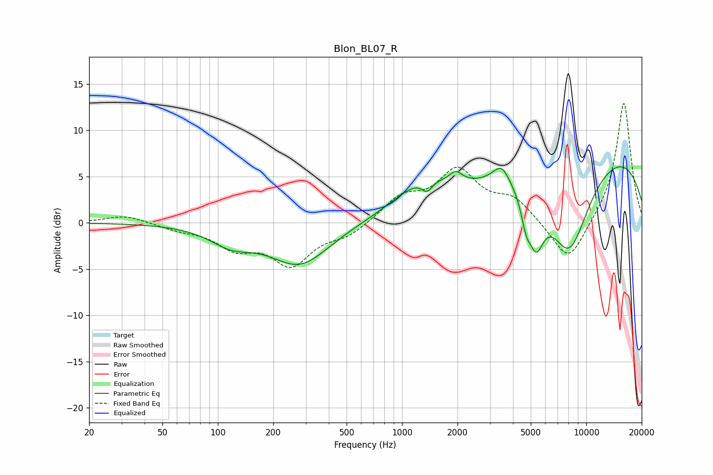

# Blon_BL07_R
See [usage instructions](https://github.com/jaakkopasanen/AutoEq#usage) for more options and info.

### Parametric EQs
Apply preamp of -6.1 dB when using parametric equalizer.

|   # | Type    |   Fc (Hz) |    Q |   Gain (dB) |
|-----|---------|-----------|------|-------------|
|   1 | Peaking |       119 | 1.2  |        -1.8 |
|   2 | Peaking |       279 | 0.87 |        -4.5 |
|   3 | Peaking |      1269 | 0.91 |         3.1 |
|   4 | Peaking |      1367 | 4.87 |        -1.2 |
|   5 | Peaking |      1957 | 4.2  |         1.1 |
|   6 | Peaking |      3462 | 3.04 |         2.1 |
|   7 | Peaking |      4708 | 5.55 |        -2.3 |
|   8 | Peaking |      5333 | 3.19 |        -5.4 |
|   9 | Peaking |      8070 | 1.06 |       -10.9 |
|  10 | Peaking |     10000 | 0.22 |         8.8 |

### Fixed Band EQs
When using fixed band (also called graphic) equalizer, apply preamp of **-13.0 dB** (if available) and set gains manually with these parameters.

|   # | Type    |   Fc (Hz) |    Q |   Gain (dB) |
|-----|---------|-----------|------|-------------|
|   1 | Peaking |        31 | 1.41 |         0.8 |
|   2 | Peaking |        62 | 1.41 |        -0.6 |
|   3 | Peaking |       125 | 1.41 |        -2.4 |
|   4 | Peaking |       250 | 1.41 |        -4.3 |
|   5 | Peaking |       500 | 1.41 |        -1.3 |
|   6 | Peaking |      1000 | 1.41 |         2.5 |
|   7 | Peaking |      2000 | 1.41 |         5.3 |
|   8 | Peaking |      4000 | 1.41 |         2.4 |
|   9 | Peaking |      8000 | 1.41 |        -4.7 |
|  10 | Peaking |     16000 | 1.41 |        13.2 |

### Graphs

