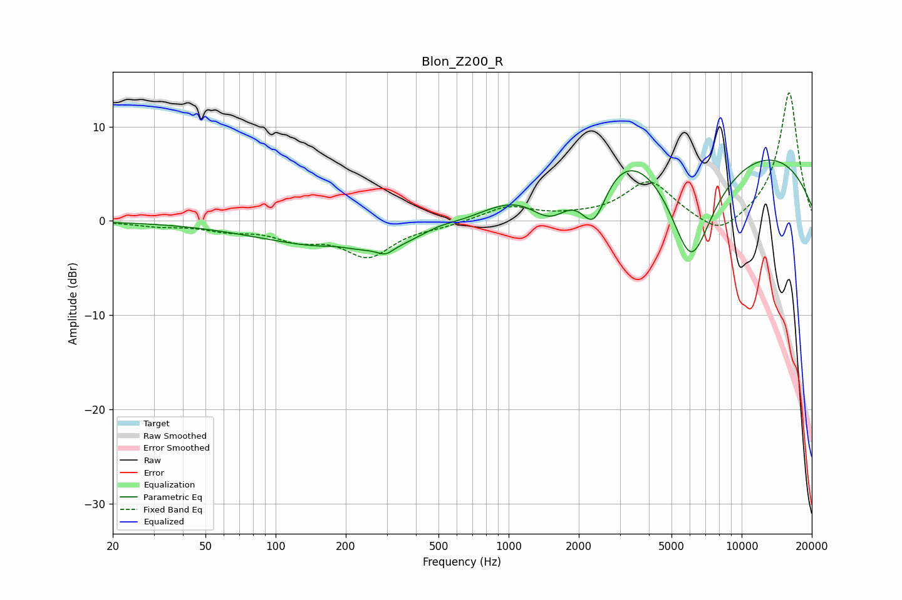

# Blon_Z200_R
See [usage instructions](https://github.com/jaakkopasanen/AutoEq#usage) for more options and info.

### Parametric EQs
Apply preamp of -6.5 dB when using parametric equalizer.

|   # | Type    |   Fc (Hz) |    Q |   Gain (dB) |
|-----|---------|-----------|------|-------------|
|   1 | Peaking |       179 | 2.73 |         0.2 |
|   2 | Peaking |       295 | 1.59 |        -0.4 |
|   3 | Peaking |       296 | 4.51 |        -0.7 |
|   4 | Peaking |       340 | 0.27 |        -4   |
|   5 | Peaking |       501 | 1.71 |         0.7 |
|   6 | Peaking |       668 | 0.54 |        -2.5 |
|   7 | Peaking |      1524 | 1.34 |        -6.1 |
|   8 | Peaking |      2318 | 2.28 |        -6.6 |
|   9 | Peaking |      4420 | 0.18 |        18   |
|  10 | Peaking |      6058 | 0.86 |       -20   |

### Fixed Band EQs
When using fixed band (also called graphic) equalizer, apply preamp of **-13.7 dB** (if available) and set gains manually with these parameters.

|   # | Type    |   Fc (Hz) |    Q |   Gain (dB) |
|-----|---------|-----------|------|-------------|
|   1 | Peaking |        31 | 1.41 |        -0.4 |
|   2 | Peaking |        62 | 1.41 |        -0.8 |
|   3 | Peaking |       125 | 1.41 |        -1.6 |
|   4 | Peaking |       250 | 1.41 |        -3.6 |
|   5 | Peaking |       500 | 1.41 |        -0.4 |
|   6 | Peaking |      1000 | 1.41 |         1.5 |
|   7 | Peaking |      2000 | 1.41 |         0.3 |
|   8 | Peaking |      4000 | 1.41 |         4.2 |
|   9 | Peaking |      8000 | 1.41 |        -2   |
|  10 | Peaking |     16000 | 1.41 |        13.8 |

### Graphs

