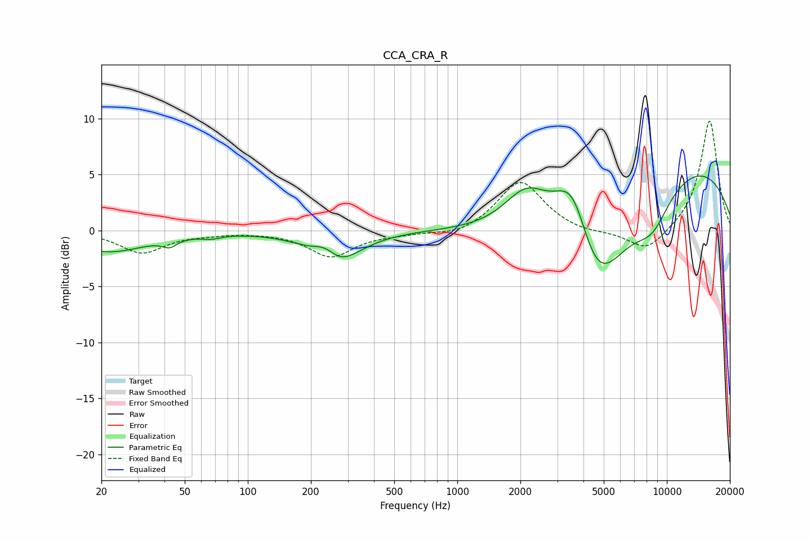

# CCA_CRA_R
See [usage instructions](https://github.com/jaakkopasanen/AutoEq#usage) for more options and info.

### Parametric EQs
Apply preamp of -5.0 dB when using parametric equalizer.

|   # | Type    |   Fc (Hz) |    Q |   Gain (dB) |
|-----|---------|-----------|------|-------------|
|   1 | Peaking |        22 | 0.8  |        -1.9 |
|   2 | Peaking |        42 | 4.24 |        -0.7 |
|   3 | Peaking |        67 | 3.16 |        -0.3 |
|   4 | Peaking |       235 | 2.33 |         1.8 |
|   5 | Peaking |       257 | 1.29 |        -3.6 |
|   6 | Peaking |      2137 | 1.32 |         3.6 |
|   7 | Peaking |      3582 | 1.4  |         8.3 |
|   8 | Peaking |      4497 | 0.81 |       -13.1 |
|   9 | Peaking |      8533 | 1.5  |        -2.9 |
|  10 | Peaking |      9888 | 0.25 |         6.9 |

### Fixed Band EQs
When using fixed band (also called graphic) equalizer, apply preamp of **-9.9 dB** (if available) and set gains manually with these parameters.

|   # | Type    |   Fc (Hz) |    Q |   Gain (dB) |
|-----|---------|-----------|------|-------------|
|   1 | Peaking |        31 | 1.41 |        -2   |
|   2 | Peaking |        62 | 1.41 |        -0.2 |
|   3 | Peaking |       125 | 1.41 |        -0.1 |
|   4 | Peaking |       250 | 1.41 |        -2.3 |
|   5 | Peaking |       500 | 1.41 |        -0.2 |
|   6 | Peaking |      1000 | 1.41 |        -0.6 |
|   7 | Peaking |      2000 | 1.41 |         4.5 |
|   8 | Peaking |      4000 | 1.41 |        -0.3 |
|   9 | Peaking |      8000 | 1.41 |        -2   |
|  10 | Peaking |     16000 | 1.41 |         9.9 |

### Graphs

