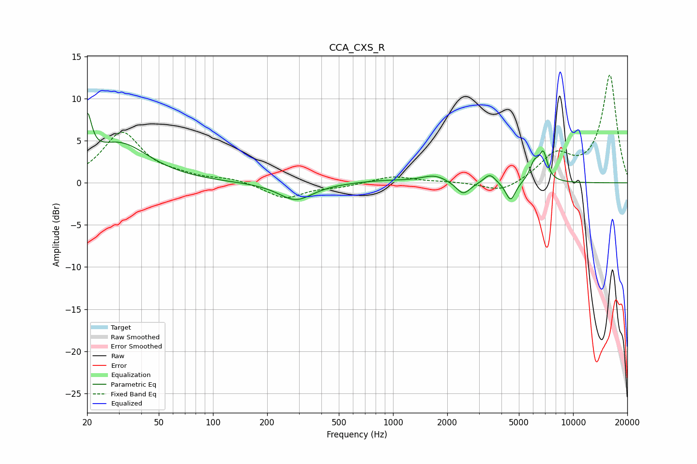

# CCA_CXS_R
See [usage instructions](https://github.com/jaakkopasanen/AutoEq#usage) for more options and info.

### Parametric EQs
Apply preamp of -8.4 dB when using parametric equalizer.

|   # | Type    |   Fc (Hz) |    Q |   Gain (dB) |
|-----|---------|-----------|------|-------------|
|   1 | Peaking |        20 | 5.91 |         5.3 |
|   2 | Peaking |        30 | 0.85 |         4.6 |
|   3 | Peaking |       288 | 1.49 |        -2.1 |
|   4 | Peaking |       885 | 0.91 |         0.3 |
|   5 | Peaking |      1699 | 2.03 |         0.9 |
|   6 | Peaking |      2453 | 3.56 |        -1.5 |
|   7 | Peaking |      3448 | 4.44 |         1.1 |
|   8 | Peaking |      4498 | 5.11 |        -2.3 |
|   9 | Peaking |      6087 | 5.48 |         2   |
|  10 | Peaking |      6831 | 5.86 |         3.2 |

### Fixed Band EQs
When using fixed band (also called graphic) equalizer, apply preamp of **-12.9 dB** (if available) and set gains manually with these parameters.

|   # | Type    |   Fc (Hz) |    Q |   Gain (dB) |
|-----|---------|-----------|------|-------------|
|   1 | Peaking |        31 | 1.41 |         5.9 |
|   2 | Peaking |        62 | 1.41 |         0.6 |
|   3 | Peaking |       125 | 1.41 |         0.5 |
|   4 | Peaking |       250 | 1.41 |        -1.8 |
|   5 | Peaking |       500 | 1.41 |        -0.4 |
|   6 | Peaking |      1000 | 1.41 |         0.8 |
|   7 | Peaking |      2000 | 1.41 |         0.1 |
|   8 | Peaking |      4000 | 1.41 |        -1.3 |
|   9 | Peaking |      8000 | 1.41 |         3.1 |
|  10 | Peaking |     16000 | 1.41 |        12.8 |

### Graphs

