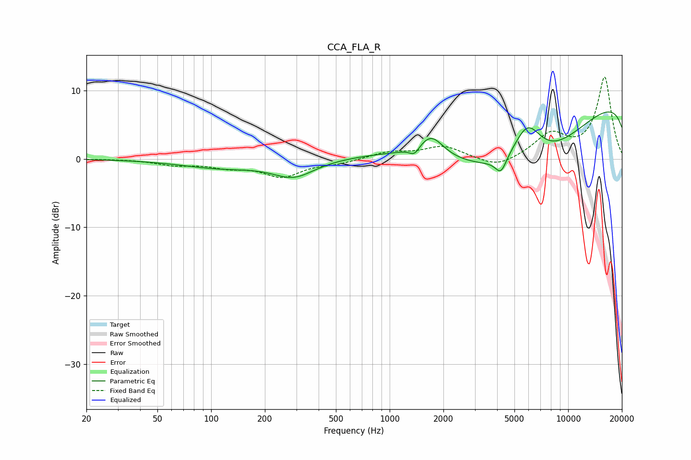

# CCA_FLA_R
See [usage instructions](https://github.com/jaakkopasanen/AutoEq#usage) for more options and info.

### Parametric EQs
Apply preamp of -7.0 dB when using parametric equalizer.

|   # | Type    |   Fc (Hz) |    Q |   Gain (dB) |
|-----|---------|-----------|------|-------------|
|   1 | Peaking |       113 | 0.62 |        -1.2 |
|   2 | Peaking |       287 | 1.23 |        -2.3 |
|   3 | Peaking |       330 | 1.62 |        -0.1 |
|   4 | Peaking |      1136 | 0.54 |         1.4 |
|   5 | Peaking |      1378 | 5.24 |        -1.1 |
|   6 | Peaking |      1709 | 2.08 |         3.2 |
|   7 | Peaking |      4199 | 4.62 |        -2.2 |
|   8 | Peaking |      5905 | 1.55 |         7.3 |
|   9 | Peaking |      6108 | 0.32 |       -17   |
|  10 | Peaking |     10000 | 0.18 |        15.6 |

### Fixed Band EQs
When using fixed band (also called graphic) equalizer, apply preamp of **-12.0 dB** (if available) and set gains manually with these parameters.

|   # | Type    |   Fc (Hz) |    Q |   Gain (dB) |
|-----|---------|-----------|------|-------------|
|   1 | Peaking |        31 | 1.41 |        -0   |
|   2 | Peaking |        62 | 1.41 |        -0.8 |
|   3 | Peaking |       125 | 1.41 |        -1   |
|   4 | Peaking |       250 | 1.41 |        -2.5 |
|   5 | Peaking |       500 | 1.41 |        -0.6 |
|   6 | Peaking |      1000 | 1.41 |         1   |
|   7 | Peaking |      2000 | 1.41 |         1.8 |
|   8 | Peaking |      4000 | 1.41 |        -1.4 |
|   9 | Peaking |      8000 | 1.41 |         3.4 |
|  10 | Peaking |     16000 | 1.41 |        11.9 |

### Graphs

