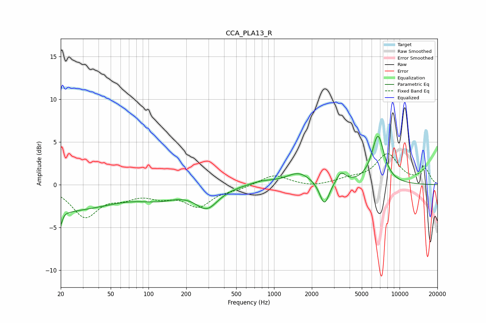

# CCA_PLA13_R
See [usage instructions](https://github.com/jaakkopasanen/AutoEq#usage) for more options and info.

### Parametric EQs
Apply preamp of -5.8 dB when using parametric equalizer.

|   # | Type    |   Fc (Hz) |    Q |   Gain (dB) |
|-----|---------|-----------|------|-------------|
|   1 | Peaking |        20 | 5.81 |        -3   |
|   2 | Peaking |        20 | 0.32 |        -3   |
|   3 | Peaking |        21 | 6    |         1.5 |
|   4 | Peaking |       122 | 0.91 |        -1.1 |
|   5 | Peaking |       292 | 1.57 |        -2.4 |
|   6 | Peaking |       796 | 1.46 |         0.4 |
|   7 | Peaking |      1573 | 1.43 |         1.4 |
|   8 | Peaking |      2519 | 3.73 |        -2.8 |
|   9 | Peaking |      3419 | 3.92 |         1.3 |
|  10 | Peaking |      6725 | 2.73 |         5.6 |

### Fixed Band EQs
When using fixed band (also called graphic) equalizer, apply preamp of **-3.7 dB** (if available) and set gains manually with these parameters.

|   # | Type    |   Fc (Hz) |    Q |   Gain (dB) |
|-----|---------|-----------|------|-------------|
|   1 | Peaking |        31 | 1.41 |        -3.6 |
|   2 | Peaking |        62 | 1.41 |        -1.1 |
|   3 | Peaking |       125 | 1.41 |        -1.1 |
|   4 | Peaking |       250 | 1.41 |        -2.4 |
|   5 | Peaking |       500 | 1.41 |        -0.4 |
|   6 | Peaking |      1000 | 1.41 |         1.2 |
|   7 | Peaking |      2000 | 1.41 |        -0.3 |
|   8 | Peaking |      4000 | 1.41 |         0.5 |
|   9 | Peaking |      8000 | 1.41 |         3.5 |
|  10 | Peaking |     16000 | 1.41 |         1.7 |

### Graphs

