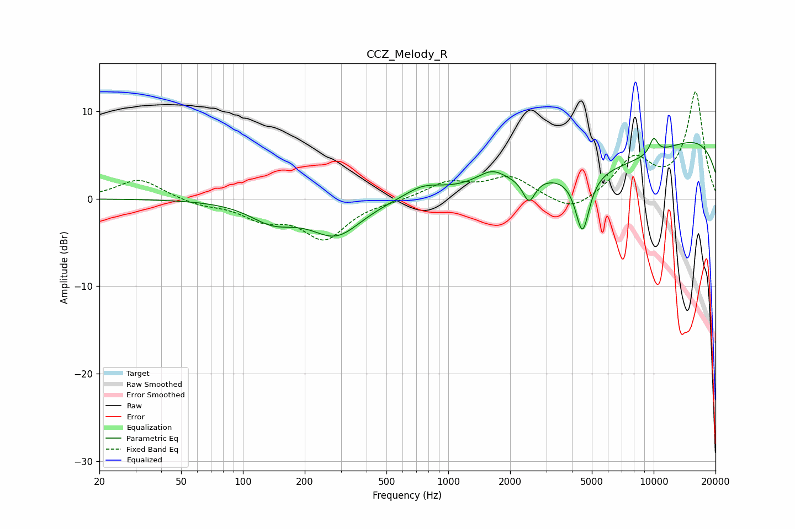

# CCZ_Melody_R
See [usage instructions](https://github.com/jaakkopasanen/AutoEq#usage) for more options and info.

### Parametric EQs
Apply preamp of -7.0 dB when using parametric equalizer.

|   # | Type    |   Fc (Hz) |    Q |   Gain (dB) |
|-----|---------|-----------|------|-------------|
|   1 | Peaking |       139 | 1.27 |        -2.2 |
|   2 | Peaking |       284 | 1.13 |        -4   |
|   3 | Peaking |       754 | 1.55 |         1.3 |
|   4 | Peaking |      1525 | 2.67 |        -0.5 |
|   5 | Peaking |      1594 | 2.09 |         2   |
|   6 | Peaking |      2472 | 4.75 |        -2.7 |
|   7 | Peaking |      4501 | 4.11 |        -6.7 |
|   8 | Peaking |      6224 | 0.35 |        -4.7 |
|   9 | Peaking |     10000 | 0.19 |         9.1 |
|  10 | Peaking |     10000 | 6    |         1.8 |

### Fixed Band EQs
When using fixed band (also called graphic) equalizer, apply preamp of **-12.3 dB** (if available) and set gains manually with these parameters.

|   # | Type    |   Fc (Hz) |    Q |   Gain (dB) |
|-----|---------|-----------|------|-------------|
|   1 | Peaking |        31 | 1.41 |         2.3 |
|   2 | Peaking |        62 | 1.41 |        -0.6 |
|   3 | Peaking |       125 | 1.41 |        -2   |
|   4 | Peaking |       250 | 1.41 |        -4.4 |
|   5 | Peaking |       500 | 1.41 |        -0.2 |
|   6 | Peaking |      1000 | 1.41 |         1.8 |
|   7 | Peaking |      2000 | 1.41 |         2.4 |
|   8 | Peaking |      4000 | 1.41 |        -1.8 |
|   9 | Peaking |      8000 | 1.41 |         4.4 |
|  10 | Peaking |     16000 | 1.41 |        12.1 |

### Graphs

