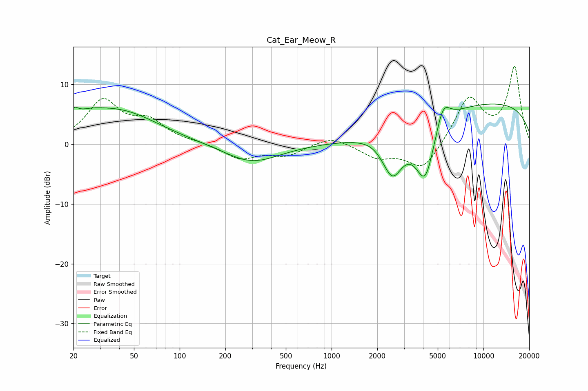

# Cat_Ear_Meow_R
See [usage instructions](https://github.com/jaakkopasanen/AutoEq#usage) for more options and info.

### Parametric EQs
Apply preamp of -6.8 dB when using parametric equalizer.

|   # | Type    |   Fc (Hz) |    Q |   Gain (dB) |
|-----|---------|-----------|------|-------------|
|   1 | Peaking |        20 | 5.25 |         1.6 |
|   2 | Peaking |        24 | 1.38 |         1.6 |
|   3 | Peaking |        40 | 0.54 |         5.3 |
|   4 | Peaking |       299 | 0.78 |        -3.1 |
|   5 | Peaking |      1867 | 2.39 |         0.3 |
|   6 | Peaking |      2515 | 2.01 |        -7.2 |
|   7 | Peaking |      4138 | 2.02 |       -10.4 |
|   8 | Peaking |      5408 | 2.97 |         4.3 |
|   9 | Peaking |     10000 | 0.2  |         6.3 |
|  10 | Peaking |     10000 | 0.2  |         0.8 |

### Fixed Band EQs
When using fixed band (also called graphic) equalizer, apply preamp of **-13.1 dB** (if available) and set gains manually with these parameters.

|   # | Type    |   Fc (Hz) |    Q |   Gain (dB) |
|-----|---------|-----------|------|-------------|
|   1 | Peaking |        31 | 1.41 |         7   |
|   2 | Peaking |        62 | 1.41 |         3.4 |
|   3 | Peaking |       125 | 1.41 |         0.2 |
|   4 | Peaking |       250 | 1.41 |        -2.4 |
|   5 | Peaking |       500 | 1.41 |        -1.8 |
|   6 | Peaking |      1000 | 1.41 |         1.5 |
|   7 | Peaking |      2000 | 1.41 |        -2.1 |
|   8 | Peaking |      4000 | 1.41 |        -4.5 |
|   9 | Peaking |      8000 | 1.41 |         7.7 |
|  10 | Peaking |     16000 | 1.41 |        12.7 |

### Graphs

