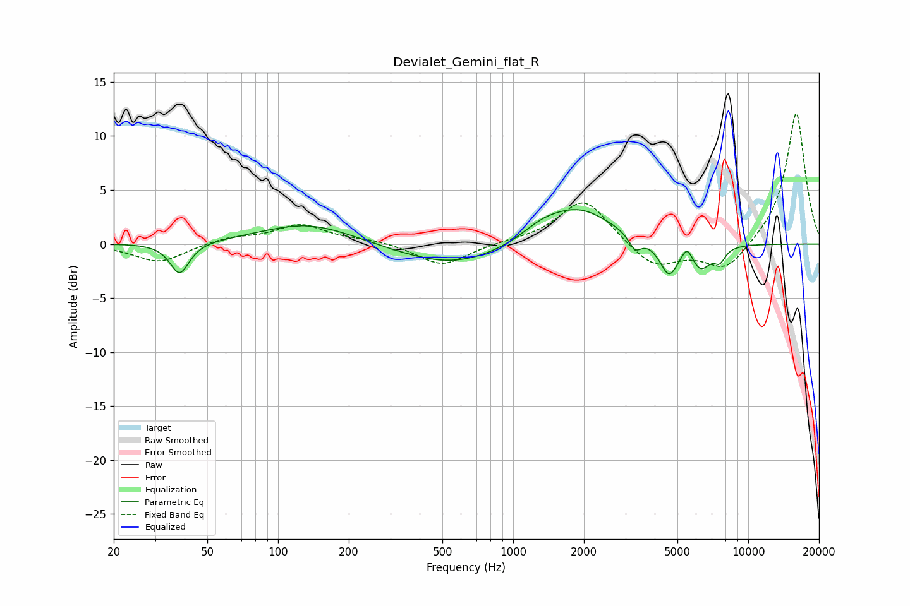

# Devialet_Gemini_flat_R
See [usage instructions](https://github.com/jaakkopasanen/AutoEq#usage) for more options and info.

### Parametric EQs
Apply preamp of -3.3 dB when using parametric equalizer.

|   # | Type    |   Fc (Hz) |    Q |   Gain (dB) |
|-----|---------|-----------|------|-------------|
|   1 | Peaking |        38 | 3.53 |        -2.9 |
|   2 | Peaking |       134 | 0.71 |         2   |
|   3 | Peaking |       555 | 0.62 |        -2.1 |
|   4 | Peaking |      1316 | 1.67 |         0.9 |
|   5 | Peaking |      1891 | 0.97 |         3.3 |
|   6 | Peaking |      3298 | 5.32 |        -1.4 |
|   7 | Peaking |      4599 | 3.55 |        -3   |
|   8 | Peaking |      5502 | 5.99 |         1.3 |
|   9 | Peaking |      6257 | 3.11 |        -2.3 |
|  10 | Peaking |      7562 | 5.62 |        -1.2 |

### Fixed Band EQs
When using fixed band (also called graphic) equalizer, apply preamp of **-12.2 dB** (if available) and set gains manually with these parameters.

|   # | Type    |   Fc (Hz) |    Q |   Gain (dB) |
|-----|---------|-----------|------|-------------|
|   1 | Peaking |        31 | 1.41 |        -1.7 |
|   2 | Peaking |        62 | 1.41 |         0.6 |
|   3 | Peaking |       125 | 1.41 |         1.7 |
|   4 | Peaking |       250 | 1.41 |         0.3 |
|   5 | Peaking |       500 | 1.41 |        -2.1 |
|   6 | Peaking |      1000 | 1.41 |         0.2 |
|   7 | Peaking |      2000 | 1.41 |         4.3 |
|   8 | Peaking |      4000 | 1.41 |        -2.3 |
|   9 | Peaking |      8000 | 1.41 |        -2.6 |
|  10 | Peaking |     16000 | 1.41 |        12.3 |

### Graphs

