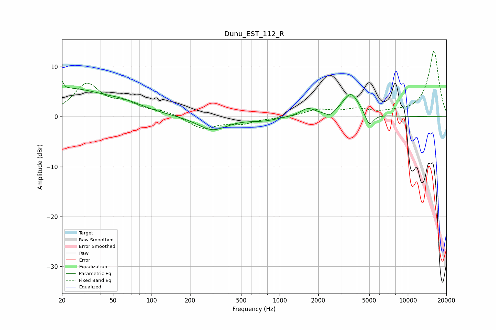

# Dunu_EST_112_R
See [usage instructions](https://github.com/jaakkopasanen/AutoEq#usage) for more options and info.

### Parametric EQs
Apply preamp of -7.3 dB when using parametric equalizer.

|   # | Type    |   Fc (Hz) |    Q |   Gain (dB) |
|-----|---------|-----------|------|-------------|
|   1 | Peaking |        20 | 6    |         5.6 |
|   2 | Peaking |        20 | 6    |        -3.8 |
|   3 | Peaking |        23 | 0.51 |         5.2 |
|   4 | Peaking |        62 | 0.87 |         1.4 |
|   5 | Peaking |       298 | 1.23 |        -2.7 |
|   6 | Peaking |       749 | 1.31 |        -0.7 |
|   7 | Peaking |      1661 | 2.5  |         1.6 |
|   8 | Peaking |      2467 | 4.51 |        -1   |
|   9 | Peaking |      3599 | 2.16 |         4.7 |
|  10 | Peaking |      5014 | 4.3  |        -2.8 |

### Fixed Band EQs
When using fixed band (also called graphic) equalizer, apply preamp of **-13.2 dB** (if available) and set gains manually with these parameters.

|   # | Type    |   Fc (Hz) |    Q |   Gain (dB) |
|-----|---------|-----------|------|-------------|
|   1 | Peaking |        31 | 1.41 |         6.3 |
|   2 | Peaking |        62 | 1.41 |         2.1 |
|   3 | Peaking |       125 | 1.41 |         0.9 |
|   4 | Peaking |       250 | 1.41 |        -2.4 |
|   5 | Peaking |       500 | 1.41 |        -1.2 |
|   6 | Peaking |      1000 | 1.41 |        -0.2 |
|   7 | Peaking |      2000 | 1.41 |         1.3 |
|   8 | Peaking |      4000 | 1.41 |         1.3 |
|   9 | Peaking |      8000 | 1.41 |         0.6 |
|  10 | Peaking |     16000 | 1.41 |        13.2 |

### Graphs

