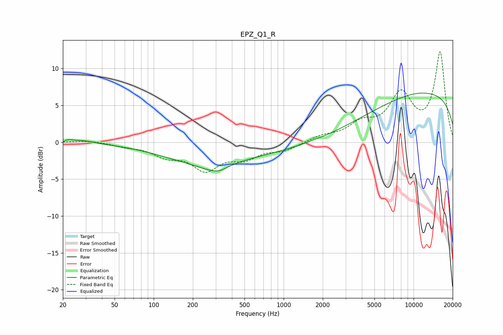

# EPZ_Q1_R
See [usage instructions](https://github.com/jaakkopasanen/AutoEq#usage) for more options and info.

### Parametric EQs
Apply preamp of -6.8 dB when using parametric equalizer.

|   # | Type    |   Fc (Hz) |    Q |   Gain (dB) |
|-----|---------|-----------|------|-------------|
|   1 | Peaking |        20 | 5.95 |        -0.4 |
|   2 | Peaking |        21 | 3.11 |         0.5 |
|   3 | Peaking |        30 | 1.99 |         0.3 |
|   4 | Peaking |       275 | 1.42 |        -0.6 |
|   5 | Peaking |       321 | 2.41 |        -0.6 |
|   6 | Peaking |       845 | 0.18 |        -6.6 |
|   7 | Peaking |       909 | 0.31 |         4.3 |
|   8 | Peaking |      1710 | 4.57 |         0.1 |
|   9 | Peaking |     10000 | 0.18 |         7   |
|  10 | Peaking |     10000 | 1.03 |         0.2 |

### Fixed Band EQs
When using fixed band (also called graphic) equalizer, apply preamp of **-12.3 dB** (if available) and set gains manually with these parameters.

|   # | Type    |   Fc (Hz) |    Q |   Gain (dB) |
|-----|---------|-----------|------|-------------|
|   1 | Peaking |        31 | 1.41 |         0.3 |
|   2 | Peaking |        62 | 1.41 |        -0.4 |
|   3 | Peaking |       125 | 1.41 |        -1.6 |
|   4 | Peaking |       250 | 1.41 |        -3.4 |
|   5 | Peaking |       500 | 1.41 |        -1.8 |
|   6 | Peaking |      1000 | 1.41 |        -1   |
|   7 | Peaking |      2000 | 1.41 |         0.7 |
|   8 | Peaking |      4000 | 1.41 |         2.1 |
|   9 | Peaking |      8000 | 1.41 |         6   |
|  10 | Peaking |     16000 | 1.41 |        12   |

### Graphs

