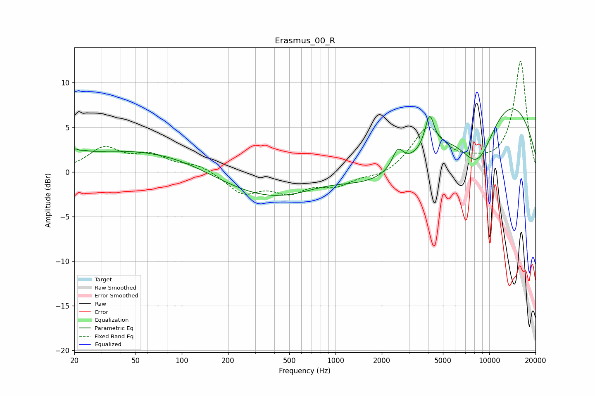

# Erasmus_00_R
See [usage instructions](https://github.com/jaakkopasanen/AutoEq#usage) for more options and info.

### Parametric EQs
Apply preamp of -7.2 dB when using parametric equalizer.

|   # | Type    |   Fc (Hz) |    Q |   Gain (dB) |
|-----|---------|-----------|------|-------------|
|   1 | Peaking |        21 | 4.95 |         2.2 |
|   2 | Peaking |        21 | 5.89 |        -1.7 |
|   3 | Peaking |        24 | 0.31 |        -1   |
|   4 | Peaking |        41 | 0.24 |         3.4 |
|   5 | Peaking |       898 | 0.18 |        -4.7 |
|   6 | Peaking |       916 | 0.63 |         2.3 |
|   7 | Peaking |      2541 | 3.93 |         2.1 |
|   8 | Peaking |      4094 | 4.69 |         3.8 |
|   9 | Peaking |      8415 | 0.99 |        -8   |
|  10 | Peaking |     10000 | 0.29 |        10.6 |

### Fixed Band EQs
When using fixed band (also called graphic) equalizer, apply preamp of **-12.5 dB** (if available) and set gains manually with these parameters.

|   # | Type    |   Fc (Hz) |    Q |   Gain (dB) |
|-----|---------|-----------|------|-------------|
|   1 | Peaking |        31 | 1.41 |         2.5 |
|   2 | Peaking |        62 | 1.41 |         1.6 |
|   3 | Peaking |       125 | 1.41 |         0.8 |
|   4 | Peaking |       250 | 1.41 |        -2.3 |
|   5 | Peaking |       500 | 1.41 |        -2   |
|   6 | Peaking |      1000 | 1.41 |        -1.4 |
|   7 | Peaking |      2000 | 1.41 |        -0.6 |
|   8 | Peaking |      4000 | 1.41 |         4.9 |
|   9 | Peaking |      8000 | 1.41 |         0.6 |
|  10 | Peaking |     16000 | 1.41 |        12.4 |

### Graphs

