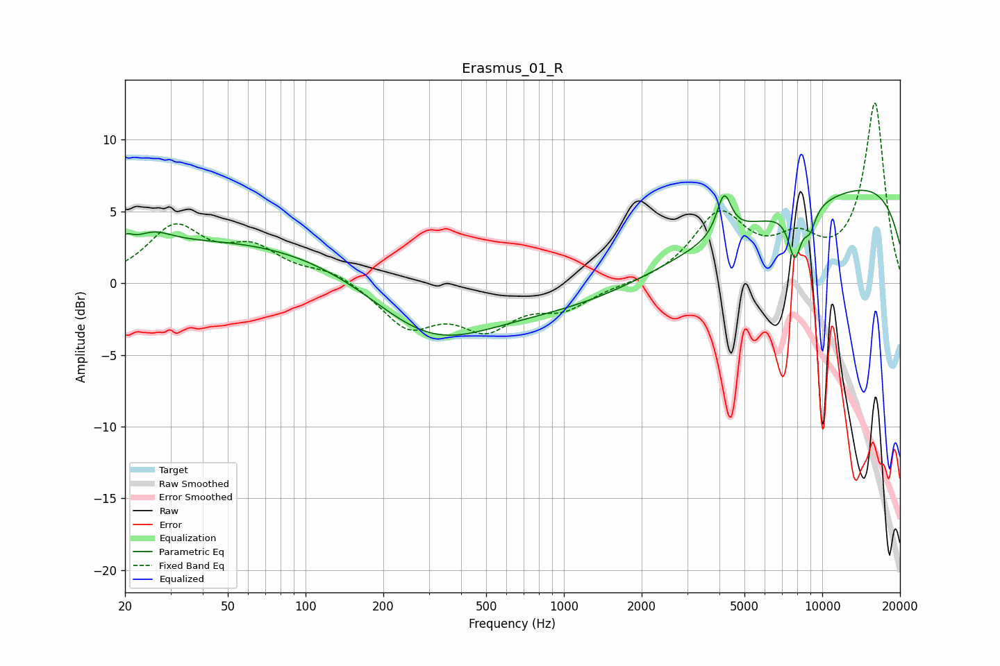

# Erasmus_01_R
See [usage instructions](https://github.com/jaakkopasanen/AutoEq#usage) for more options and info.

### Parametric EQs
Apply preamp of -6.6 dB when using parametric equalizer.

|   # | Type    |   Fc (Hz) |    Q |   Gain (dB) |
|-----|---------|-----------|------|-------------|
|   1 | Peaking |        20 | 5.69 |         0.7 |
|   2 | Peaking |        26 | 2.02 |         1   |
|   3 | Peaking |        35 | 5.83 |         0   |
|   4 | Peaking |        77 | 0.18 |         3.3 |
|   5 | Peaking |       302 | 0.55 |        -5.4 |
|   6 | Peaking |      3394 | 0.22 |        -3.6 |
|   7 | Peaking |      4169 | 5.06 |         2.9 |
|   8 | Peaking |      7830 | 5.29 |        -3.2 |
|   9 | Peaking |      8948 | 5.33 |        -1.5 |
|  10 | Peaking |      9740 | 0.18 |         8.4 |

### Fixed Band EQs
When using fixed band (also called graphic) equalizer, apply preamp of **-12.7 dB** (if available) and set gains manually with these parameters.

|   # | Type    |   Fc (Hz) |    Q |   Gain (dB) |
|-----|---------|-----------|------|-------------|
|   1 | Peaking |        31 | 1.41 |         3.7 |
|   2 | Peaking |        62 | 1.41 |         2.1 |
|   3 | Peaking |       125 | 1.41 |         0.8 |
|   4 | Peaking |       250 | 1.41 |        -2.9 |
|   5 | Peaking |       500 | 1.41 |        -2.8 |
|   6 | Peaking |      1000 | 1.41 |        -1.6 |
|   7 | Peaking |      2000 | 1.41 |        -0.1 |
|   8 | Peaking |      4000 | 1.41 |         4.6 |
|   9 | Peaking |      8000 | 1.41 |         2.4 |
|  10 | Peaking |     16000 | 1.41 |        12.5 |

### Graphs

