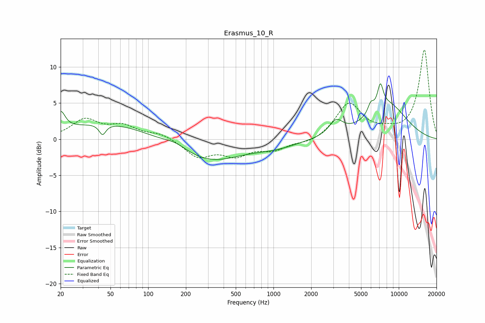

# Erasmus_10_R
See [usage instructions](https://github.com/jaakkopasanen/AutoEq#usage) for more options and info.

### Parametric EQs
Apply preamp of -7.8 dB when using parametric equalizer.

|   # | Type    |   Fc (Hz) |    Q |   Gain (dB) |
|-----|---------|-----------|------|-------------|
|   1 | Peaking |        20 | 3.98 |         2.6 |
|   2 | Peaking |        43 | 5.34 |        -1.5 |
|   3 | Peaking |        47 | 0.45 |         2.3 |
|   4 | Peaking |       165 | 1.55 |         0.8 |
|   5 | Peaking |       307 | 0.55 |        -3   |
|   6 | Peaking |      1051 | 0.84 |        -0.9 |
|   7 | Peaking |      3155 | 2.59 |         2   |
|   8 | Peaking |      5970 | 5.88 |         1.3 |
|   9 | Peaking |      7128 | 5.88 |         3.1 |
|  10 | Peaking |      8189 | 0.83 |         4.7 |

### Fixed Band EQs
When using fixed band (also called graphic) equalizer, apply preamp of **-12.4 dB** (if available) and set gains manually with these parameters.

|   # | Type    |   Fc (Hz) |    Q |   Gain (dB) |
|-----|---------|-----------|------|-------------|
|   1 | Peaking |        31 | 1.41 |         2.6 |
|   2 | Peaking |        62 | 1.41 |         1.6 |
|   3 | Peaking |       125 | 1.41 |         0.8 |
|   4 | Peaking |       250 | 1.41 |        -2.4 |
|   5 | Peaking |       500 | 1.41 |        -2   |
|   6 | Peaking |      1000 | 1.41 |        -1.3 |
|   7 | Peaking |      2000 | 1.41 |        -0.6 |
|   8 | Peaking |      4000 | 1.41 |         4.9 |
|   9 | Peaking |      8000 | 1.41 |         0.7 |
|  10 | Peaking |     16000 | 1.41 |        12.4 |

### Graphs

