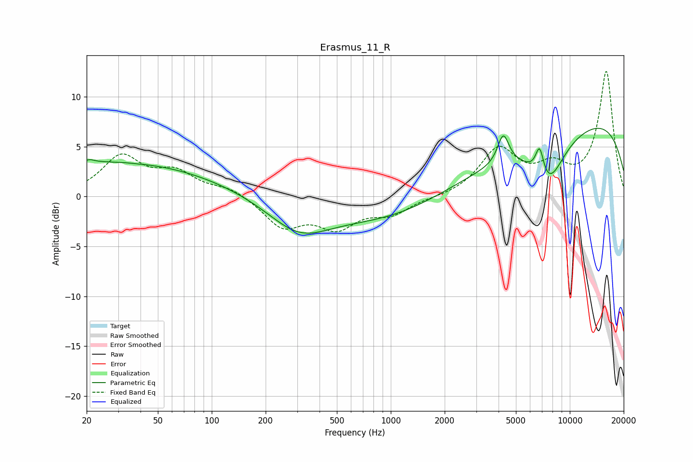

# Erasmus_11_R
See [usage instructions](https://github.com/jaakkopasanen/AutoEq#usage) for more options and info.

### Parametric EQs
Apply preamp of -6.9 dB when using parametric equalizer.

|   # | Type    |   Fc (Hz) |    Q |   Gain (dB) |
|-----|---------|-----------|------|-------------|
|   1 | Peaking |        21 | 5.58 |         0.3 |
|   2 | Peaking |        24 | 0.2  |         2.9 |
|   3 | Peaking |        31 | 0.3  |         0.6 |
|   4 | Peaking |        39 | 5.8  |        -0   |
|   5 | Peaking |       307 | 0.82 |        -3.2 |
|   6 | Peaking |      3079 | 0.19 |        -5.6 |
|   7 | Peaking |      4250 | 4.46 |         3   |
|   8 | Peaking |      6783 | 5.65 |         3.1 |
|   9 | Peaking |      7513 | 1.51 |        -4.4 |
|  10 | Peaking |      8393 | 0.18 |        10.5 |

### Fixed Band EQs
When using fixed band (also called graphic) equalizer, apply preamp of **-12.6 dB** (if available) and set gains manually with these parameters.

|   # | Type    |   Fc (Hz) |    Q |   Gain (dB) |
|-----|---------|-----------|------|-------------|
|   1 | Peaking |        31 | 1.41 |         3.9 |
|   2 | Peaking |        62 | 1.41 |         2.2 |
|   3 | Peaking |       125 | 1.41 |         0.9 |
|   4 | Peaking |       250 | 1.41 |        -2.9 |
|   5 | Peaking |       500 | 1.41 |        -2.8 |
|   6 | Peaking |      1000 | 1.41 |        -1.6 |
|   7 | Peaking |      2000 | 1.41 |        -0.1 |
|   8 | Peaking |      4000 | 1.41 |         4.6 |
|   9 | Peaking |      8000 | 1.41 |         2.4 |
|  10 | Peaking |     16000 | 1.41 |        12.5 |

### Graphs

