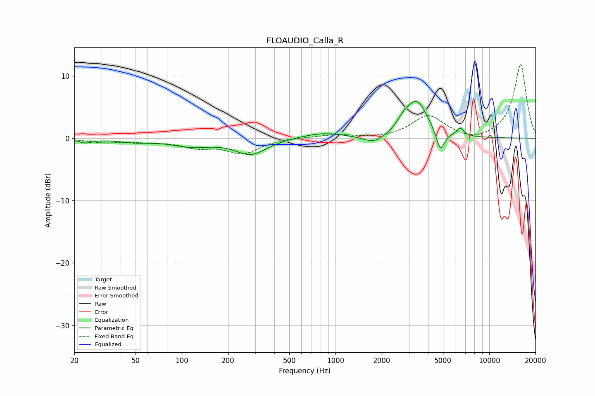

# FLOAUDIO_Calla_R
See [usage instructions](https://github.com/jaakkopasanen/AutoEq#usage) for more options and info.

### Parametric EQs
Apply preamp of -6.0 dB when using parametric equalizer.

|   # | Type    |   Fc (Hz) |    Q |   Gain (dB) |
|-----|---------|-----------|------|-------------|
|   1 | Peaking |        24 | 3.3  |        -0.6 |
|   2 | Peaking |        49 | 1.32 |        -0.5 |
|   3 | Peaking |       116 | 1.1  |        -1.2 |
|   4 | Peaking |       281 | 1.39 |        -2.5 |
|   5 | Peaking |       825 | 1    |         0.9 |
|   6 | Peaking |      1782 | 2.03 |        -1.3 |
|   7 | Peaking |      2773 | 3.69 |         1.1 |
|   8 | Peaking |      3376 | 1.95 |         5.8 |
|   9 | Peaking |      4801 | 5.1  |        -3.4 |
|  10 | Peaking |      6479 | 5.99 |         1.3 |

### Fixed Band EQs
When using fixed band (also called graphic) equalizer, apply preamp of **-11.9 dB** (if available) and set gains manually with these parameters.

|   # | Type    |   Fc (Hz) |    Q |   Gain (dB) |
|-----|---------|-----------|------|-------------|
|   1 | Peaking |        31 | 1.41 |        -0.6 |
|   2 | Peaking |        62 | 1.41 |        -0.4 |
|   3 | Peaking |       125 | 1.41 |        -1.3 |
|   4 | Peaking |       250 | 1.41 |        -2.3 |
|   5 | Peaking |       500 | 1.41 |         0.1 |
|   6 | Peaking |      1000 | 1.41 |         0.5 |
|   7 | Peaking |      2000 | 1.41 |        -0.1 |
|   8 | Peaking |      4000 | 1.41 |         3.6 |
|   9 | Peaking |      8000 | 1.41 |        -0.7 |
|  10 | Peaking |     16000 | 1.41 |        11.9 |

### Graphs

