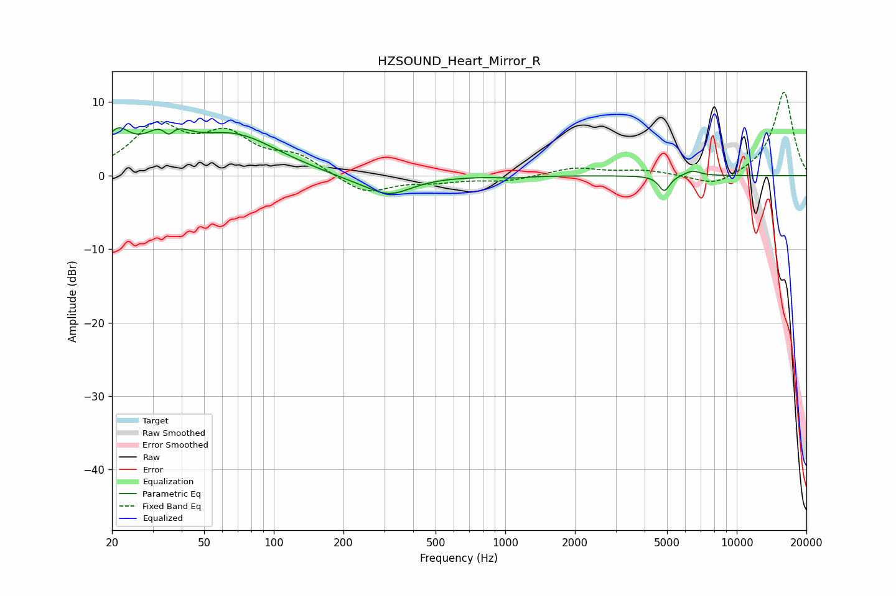

# HZSOUND_Heart_Mirror_R
See [usage instructions](https://github.com/jaakkopasanen/AutoEq#usage) for more options and info.

### Parametric EQs
Apply preamp of -6.6 dB when using parametric equalizer.

|   # | Type    |   Fc (Hz) |    Q |   Gain (dB) |
|-----|---------|-----------|------|-------------|
|   1 | Peaking |        21 | 2.54 |         4.4 |
|   2 | Peaking |        33 | 1.57 |         2   |
|   3 | Peaking |        35 | 5.92 |        -1.9 |
|   4 | Peaking |        35 | 1.97 |         2.7 |
|   5 | Peaking |        68 | 0.76 |         5.2 |
|   6 | Peaking |       212 | 1.1  |        -0.6 |
|   7 | Peaking |       315 | 1.43 |        -2.6 |
|   8 | Peaking |      1078 | 2.37 |        -0.2 |
|   9 | Peaking |      4865 | 6    |        -2.1 |
|  10 | Peaking |      6421 | 3.89 |         0.7 |

### Fixed Band EQs
When using fixed band (also called graphic) equalizer, apply preamp of **-11.4 dB** (if available) and set gains manually with these parameters.

|   # | Type    |   Fc (Hz) |    Q |   Gain (dB) |
|-----|---------|-----------|------|-------------|
|   1 | Peaking |        31 | 1.41 |         6.4 |
|   2 | Peaking |        62 | 1.41 |         4.9 |
|   3 | Peaking |       125 | 1.41 |         2.4 |
|   4 | Peaking |       250 | 1.41 |        -2.5 |
|   5 | Peaking |       500 | 1.41 |        -0.7 |
|   6 | Peaking |      1000 | 1.41 |        -0.7 |
|   7 | Peaking |      2000 | 1.41 |         1.1 |
|   8 | Peaking |      4000 | 1.41 |         0.7 |
|   9 | Peaking |      8000 | 1.41 |        -1.6 |
|  10 | Peaking |     16000 | 1.41 |        11.5 |

### Graphs

