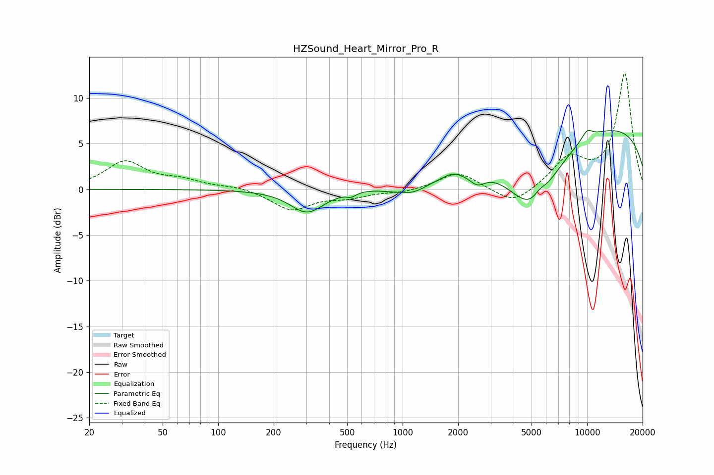

# HZSound_Heart_Mirror_Pro_R
See [usage instructions](https://github.com/jaakkopasanen/AutoEq#usage) for more options and info.

### Parametric EQs
Apply preamp of -6.5 dB when using parametric equalizer.

|   # | Type    |   Fc (Hz) |    Q |   Gain (dB) |
|-----|---------|-----------|------|-------------|
|   1 | Peaking |       303 | 1.55 |        -2.5 |
|   2 | Peaking |       527 | 5.98 |        -0.4 |
|   3 | Peaking |       830 | 3.56 |        -0.1 |
|   4 | Peaking |      1130 | 1.53 |        -1.3 |
|   5 | Peaking |      1867 | 3.29 |         0.4 |
|   6 | Peaking |      2538 | 3.24 |        -1.3 |
|   7 | Peaking |      5040 | 0.94 |        -7.8 |
|   8 | Peaking |      5539 | 4.17 |         0.8 |
|   9 | Peaking |     10000 | 3.95 |         1   |
|  10 | Peaking |     10000 | 0.18 |         7.4 |

### Fixed Band EQs
When using fixed band (also called graphic) equalizer, apply preamp of **-12.8 dB** (if available) and set gains manually with these parameters.

|   # | Type    |   Fc (Hz) |    Q |   Gain (dB) |
|-----|---------|-----------|------|-------------|
|   1 | Peaking |        31 | 1.41 |         3   |
|   2 | Peaking |        62 | 1.41 |         0.8 |
|   3 | Peaking |       125 | 1.41 |         0.3 |
|   4 | Peaking |       250 | 1.41 |        -2.2 |
|   5 | Peaking |       500 | 1.41 |        -0.7 |
|   6 | Peaking |      1000 | 1.41 |        -0.3 |
|   7 | Peaking |      2000 | 1.41 |         1.9 |
|   8 | Peaking |      4000 | 1.41 |        -1.8 |
|   9 | Peaking |      8000 | 1.41 |         3.2 |
|  10 | Peaking |     16000 | 1.41 |        12.6 |

### Graphs

