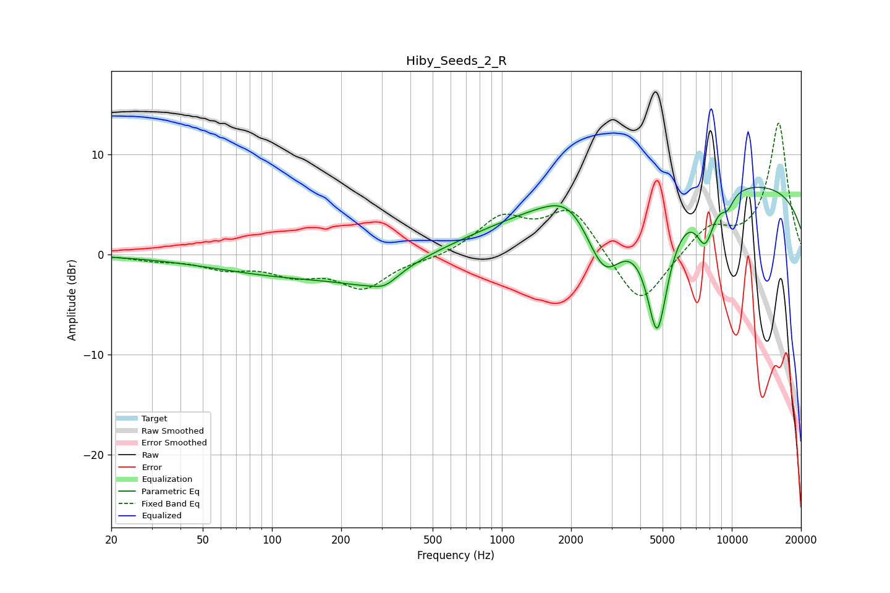

# Hiby_Seeds_2_R
See [usage instructions](https://github.com/jaakkopasanen/AutoEq#usage) for more options and info.

### Parametric EQs
Apply preamp of -6.8 dB when using parametric equalizer.

|   # | Type    |   Fc (Hz) |    Q |   Gain (dB) |
|-----|---------|-----------|------|-------------|
|   1 | Peaking |       132 | 0.38 |        -2.1 |
|   2 | Peaking |       275 | 1    |        -1.7 |
|   3 | Peaking |       311 | 2.84 |        -0.8 |
|   4 | Peaking |      1689 | 0.39 |         3   |
|   5 | Peaking |      1985 | 1.42 |         2.1 |
|   6 | Peaking |      2791 | 1.53 |        -7.7 |
|   7 | Peaking |      4740 | 2.68 |       -13.1 |
|   8 | Peaking |      7668 | 3.27 |        -4.5 |
|   9 | Peaking |      9583 | 4.47 |        -1.4 |
|  10 | Peaking |     10000 | 0.18 |         7.2 |

### Fixed Band EQs
When using fixed band (also called graphic) equalizer, apply preamp of **-13.2 dB** (if available) and set gains manually with these parameters.

|   # | Type    |   Fc (Hz) |    Q |   Gain (dB) |
|-----|---------|-----------|------|-------------|
|   1 | Peaking |        31 | 1.41 |        -0.5 |
|   2 | Peaking |        62 | 1.41 |        -1.2 |
|   3 | Peaking |       125 | 1.41 |        -1.7 |
|   4 | Peaking |       250 | 1.41 |        -3.2 |
|   5 | Peaking |       500 | 1.41 |        -0.4 |
|   6 | Peaking |      1000 | 1.41 |         3.5 |
|   7 | Peaking |      2000 | 1.41 |         4.6 |
|   8 | Peaking |      4000 | 1.41 |        -5.6 |
|   9 | Peaking |      8000 | 1.41 |         2.7 |
|  10 | Peaking |     16000 | 1.41 |        13.1 |

### Graphs

