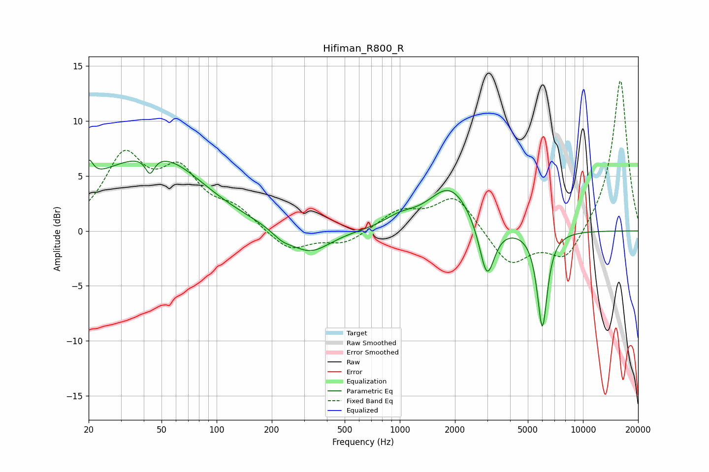

# Hifiman_R800_R
See [usage instructions](https://github.com/jaakkopasanen/AutoEq#usage) for more options and info.

### Parametric EQs
Apply preamp of -6.5 dB when using parametric equalizer.

|   # | Type    |   Fc (Hz) |    Q |   Gain (dB) |
|-----|---------|-----------|------|-------------|
|   1 | Peaking |        20 | 6    |         1.9 |
|   2 | Peaking |        36 | 0.43 |         5.6 |
|   3 | Peaking |        43 | 5.88 |        -1.6 |
|   4 | Peaking |        57 | 0.82 |         1.6 |
|   5 | Peaking |       228 | 2.61 |        -0.6 |
|   6 | Peaking |       322 | 1.25 |        -2.2 |
|   7 | Peaking |       996 | 1.76 |         0.8 |
|   8 | Peaking |      1882 | 1.2  |         4   |
|   9 | Peaking |      2991 | 3.42 |        -5.2 |
|  10 | Peaking |      5999 | 4.92 |        -8.8 |

### Fixed Band EQs
When using fixed band (also called graphic) equalizer, apply preamp of **-13.7 dB** (if available) and set gains manually with these parameters.

|   # | Type    |   Fc (Hz) |    Q |   Gain (dB) |
|-----|---------|-----------|------|-------------|
|   1 | Peaking |        31 | 1.41 |         6.4 |
|   2 | Peaking |        62 | 1.41 |         4.8 |
|   3 | Peaking |       125 | 1.41 |         1.7 |
|   4 | Peaking |       250 | 1.41 |        -1.9 |
|   5 | Peaking |       500 | 1.41 |        -1.2 |
|   6 | Peaking |      1000 | 1.41 |         1.7 |
|   7 | Peaking |      2000 | 1.41 |         3.2 |
|   8 | Peaking |      4000 | 1.41 |        -3.2 |
|   9 | Peaking |      8000 | 1.41 |        -2.8 |
|  10 | Peaking |     16000 | 1.41 |        13.9 |

### Graphs

