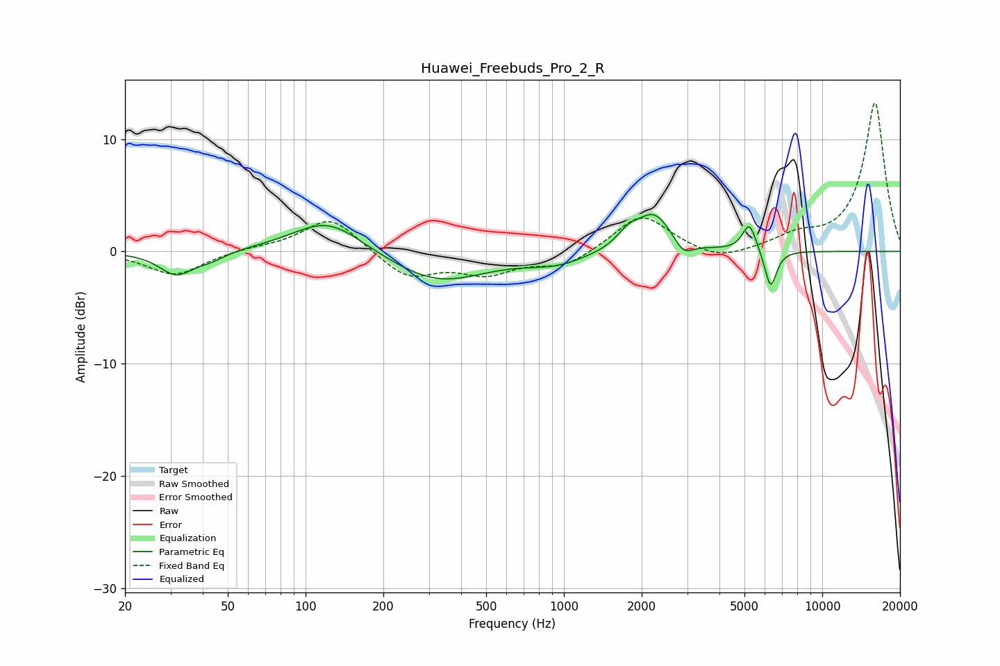

# Huawei_Freebuds_Pro_2_R
See [usage instructions](https://github.com/jaakkopasanen/AutoEq#usage) for more options and info.

### Parametric EQs
Apply preamp of -3.4 dB when using parametric equalizer.

|   # | Type    |   Fc (Hz) |    Q |   Gain (dB) |
|-----|---------|-----------|------|-------------|
|   1 | Peaking |        32 | 2.18 |        -2.1 |
|   2 | Peaking |        43 | 2.46 |        -0.6 |
|   3 | Peaking |       122 | 1.03 |         3   |
|   4 | Peaking |       324 | 0.76 |        -2.8 |
|   5 | Peaking |       931 | 1.23 |        -1   |
|   6 | Peaking |      1772 | 3.19 |         1.2 |
|   7 | Peaking |      2236 | 2.06 |         3.4 |
|   8 | Peaking |      2903 | 3.86 |        -1.3 |
|   9 | Peaking |      5224 | 5.28 |         2.5 |
|  10 | Peaking |      6315 | 6    |        -3.4 |

### Fixed Band EQs
When using fixed band (also called graphic) equalizer, apply preamp of **-13.3 dB** (if available) and set gains manually with these parameters.

|   # | Type    |   Fc (Hz) |    Q |   Gain (dB) |
|-----|---------|-----------|------|-------------|
|   1 | Peaking |        31 | 1.41 |        -2.1 |
|   2 | Peaking |        62 | 1.41 |         0.3 |
|   3 | Peaking |       125 | 1.41 |         3.1 |
|   4 | Peaking |       250 | 1.41 |        -2.4 |
|   5 | Peaking |       500 | 1.41 |        -1.8 |
|   6 | Peaking |      1000 | 1.41 |        -1.3 |
|   7 | Peaking |      2000 | 1.41 |         3.4 |
|   8 | Peaking |      4000 | 1.41 |        -1   |
|   9 | Peaking |      8000 | 1.41 |         1.2 |
|  10 | Peaking |     16000 | 1.41 |        13.3 |

### Graphs

