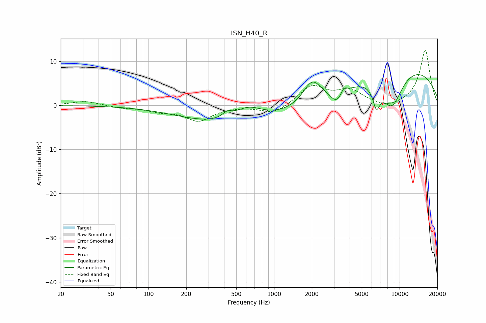

# ISN_H40_R
See [usage instructions](https://github.com/jaakkopasanen/AutoEq#usage) for more options and info.

### Parametric EQs
Apply preamp of -7.1 dB when using parametric equalizer.

|   # | Type    |   Fc (Hz) |    Q |   Gain (dB) |
|-----|---------|-----------|------|-------------|
|   1 | Peaking |       303 | 0.45 |        -2.1 |
|   2 | Peaking |       423 | 3.71 |         1.2 |
|   3 | Peaking |       623 | 1.23 |         3.3 |
|   4 | Peaking |      1083 | 0.25 |        -3.4 |
|   5 | Peaking |      2012 | 1.9  |         5.4 |
|   6 | Peaking |      3149 | 2.79 |        -2.9 |
|   7 | Peaking |      3599 | 5.95 |         1.5 |
|   8 | Peaking |      6531 | 4.85 |        -4.6 |
|   9 | Peaking |      8668 | 1.4  |        -9   |
|  10 | Peaking |      9532 | 0.26 |         9.9 |

### Fixed Band EQs
When using fixed band (also called graphic) equalizer, apply preamp of **-12.7 dB** (if available) and set gains manually with these parameters.

|   # | Type    |   Fc (Hz) |    Q |   Gain (dB) |
|-----|---------|-----------|------|-------------|
|   1 | Peaking |        31 | 1.41 |         1   |
|   2 | Peaking |        62 | 1.41 |        -0.5 |
|   3 | Peaking |       125 | 1.41 |        -1.1 |
|   4 | Peaking |       250 | 1.41 |        -3.3 |
|   5 | Peaking |       500 | 1.41 |        -0.1 |
|   6 | Peaking |      1000 | 1.41 |        -2   |
|   7 | Peaking |      2000 | 1.41 |         4.3 |
|   8 | Peaking |      4000 | 1.41 |         3.1 |
|   9 | Peaking |      8000 | 1.41 |        -0.9 |
|  10 | Peaking |     16000 | 1.41 |        12.7 |

### Graphs

