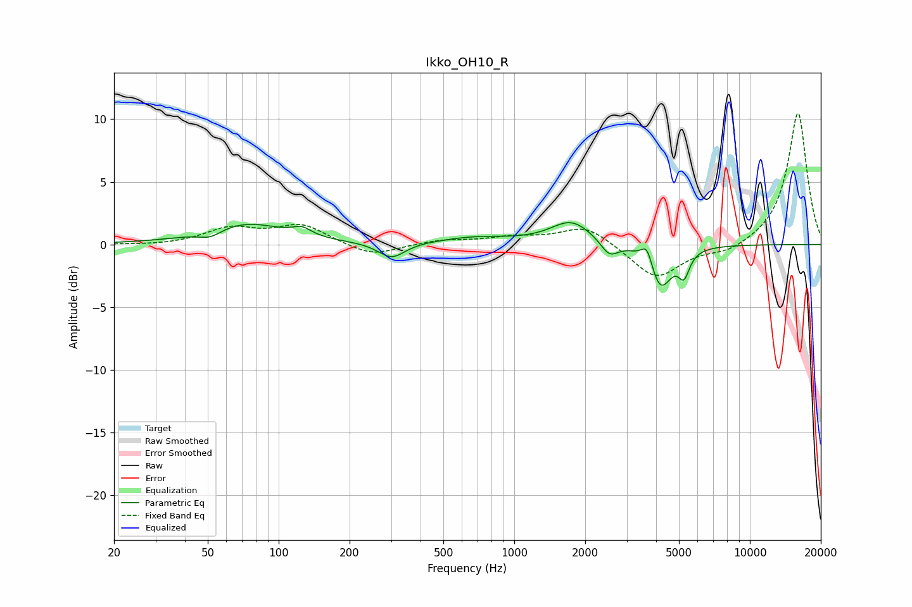

# Ikko_OH10_R
See [usage instructions](https://github.com/jaakkopasanen/AutoEq#usage) for more options and info.

### Parametric EQs
Apply preamp of -1.8 dB when using parametric equalizer.

|   # | Type    |   Fc (Hz) |    Q |   Gain (dB) |
|-----|---------|-----------|------|-------------|
|   1 | Peaking |        51 | 2.87 |        -0.6 |
|   2 | Peaking |        72 | 0.85 |         1.7 |
|   3 | Peaking |       126 | 3.56 |         0.6 |
|   4 | Peaking |       302 | 2.51 |        -1.3 |
|   5 | Peaking |       688 | 0.94 |         0.5 |
|   6 | Peaking |      1748 | 1.62 |         1.8 |
|   7 | Peaking |      2534 | 3.77 |        -1.2 |
|   8 | Peaking |      3661 | 5.99 |         1.6 |
|   9 | Peaking |      4165 | 2.92 |        -3.6 |
|  10 | Peaking |      5251 | 6    |        -1.8 |

### Fixed Band EQs
When using fixed band (also called graphic) equalizer, apply preamp of **-10.6 dB** (if available) and set gains manually with these parameters.

|   # | Type    |   Fc (Hz) |    Q |   Gain (dB) |
|-----|---------|-----------|------|-------------|
|   1 | Peaking |        31 | 1.41 |        -0.1 |
|   2 | Peaking |        62 | 1.41 |         1.2 |
|   3 | Peaking |       125 | 1.41 |         1.5 |
|   4 | Peaking |       250 | 1.41 |        -1   |
|   5 | Peaking |       500 | 1.41 |         0.3 |
|   6 | Peaking |      1000 | 1.41 |         0.5 |
|   7 | Peaking |      2000 | 1.41 |         1.5 |
|   8 | Peaking |      4000 | 1.41 |        -2.8 |
|   9 | Peaking |      8000 | 1.41 |        -0.7 |
|  10 | Peaking |     16000 | 1.41 |        10.6 |

### Graphs

