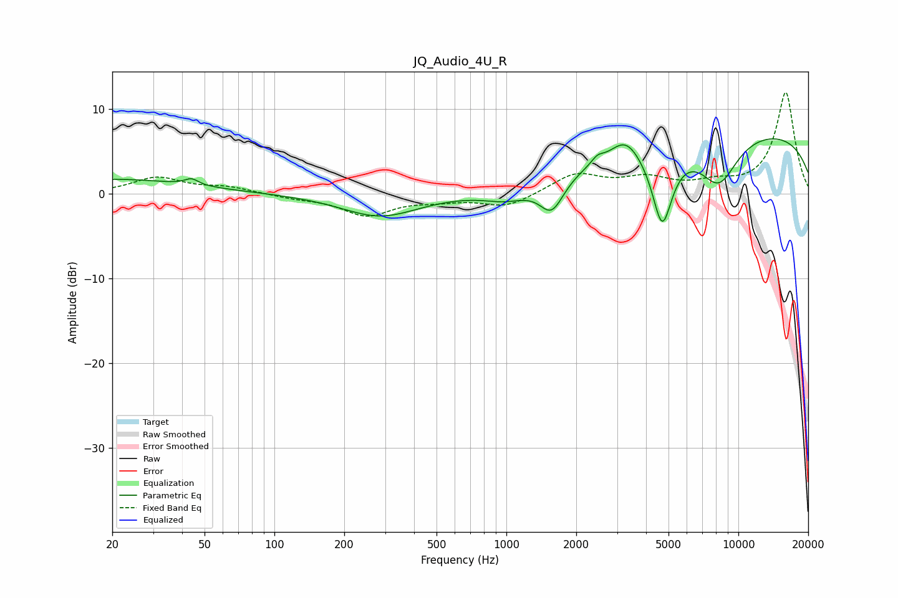

# JQ_Audio_4U_R
See [usage instructions](https://github.com/jaakkopasanen/AutoEq#usage) for more options and info.

### Parametric EQs
Apply preamp of -6.6 dB when using parametric equalizer.

|   # | Type    |   Fc (Hz) |    Q |   Gain (dB) |
|-----|---------|-----------|------|-------------|
|   1 | Peaking |        20 | 0.42 |         1.7 |
|   2 | Peaking |        44 | 4.92 |         0.7 |
|   3 | Peaking |       286 | 0.85 |        -2.7 |
|   4 | Peaking |      1002 | 1.42 |        -1.4 |
|   5 | Peaking |      1569 | 2.67 |        -3.9 |
|   6 | Peaking |      2467 | 5.66 |         0.7 |
|   7 | Peaking |      3261 | 2.25 |         2.4 |
|   8 | Peaking |      4696 | 3.1  |        -9.2 |
|   9 | Peaking |      8229 | 1.55 |        -5.7 |
|  10 | Peaking |      9883 | 0.19 |         7.6 |

### Fixed Band EQs
When using fixed band (also called graphic) equalizer, apply preamp of **-12.0 dB** (if available) and set gains manually with these parameters.

|   # | Type    |   Fc (Hz) |    Q |   Gain (dB) |
|-----|---------|-----------|------|-------------|
|   1 | Peaking |        31 | 1.41 |         1.9 |
|   2 | Peaking |        62 | 1.41 |         0.7 |
|   3 | Peaking |       125 | 1.41 |        -0.4 |
|   4 | Peaking |       250 | 1.41 |        -2.5 |
|   5 | Peaking |       500 | 1.41 |        -0.6 |
|   6 | Peaking |      1000 | 1.41 |        -1.6 |
|   7 | Peaking |      2000 | 1.41 |         2.3 |
|   8 | Peaking |      4000 | 1.41 |         1.6 |
|   9 | Peaking |      8000 | 1.41 |         1   |
|  10 | Peaking |     16000 | 1.41 |        12   |

### Graphs

