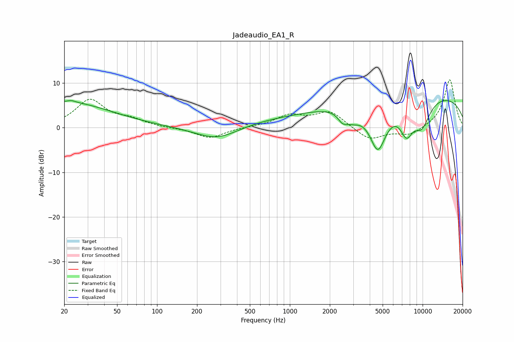

# Jadeaudio_EA1_R
See [usage instructions](https://github.com/jaakkopasanen/AutoEq#usage) for more options and info.

### Parametric EQs
Apply preamp of -6.2 dB when using parametric equalizer.

|   # | Type    |   Fc (Hz) |    Q |   Gain (dB) |
|-----|---------|-----------|------|-------------|
|   1 | Peaking |        20 | 0.4  |         5.7 |
|   2 | Peaking |        23 | 4.99 |         0.4 |
|   3 | Peaking |       284 | 0.85 |        -3.3 |
|   4 | Peaking |      1345 | 0.23 |         2.1 |
|   5 | Peaking |      2495 | 3.9  |        -2   |
|   6 | Peaking |      2957 | 2.29 |        -2.4 |
|   7 | Peaking |      4599 | 1.99 |       -11.1 |
|   8 | Peaking |      7560 | 2.64 |        -6.1 |
|   9 | Peaking |      9825 | 1.81 |        -6.2 |
|  10 | Peaking |     10000 | 0.19 |         7.6 |

### Fixed Band EQs
When using fixed band (also called graphic) equalizer, apply preamp of **-10.8 dB** (if available) and set gains manually with these parameters.

|   # | Type    |   Fc (Hz) |    Q |   Gain (dB) |
|-----|---------|-----------|------|-------------|
|   1 | Peaking |        31 | 1.41 |         6.1 |
|   2 | Peaking |        62 | 1.41 |         1.5 |
|   3 | Peaking |       125 | 1.41 |        -0.1 |
|   4 | Peaking |       250 | 1.41 |        -2.4 |
|   5 | Peaking |       500 | 1.41 |         0.1 |
|   6 | Peaking |      1000 | 1.41 |         2.6 |
|   7 | Peaking |      2000 | 1.41 |         3.5 |
|   8 | Peaking |      4000 | 1.41 |        -2.9 |
|   9 | Peaking |      8000 | 1.41 |        -1.8 |
|  10 | Peaking |     16000 | 1.41 |        10.9 |

### Graphs

