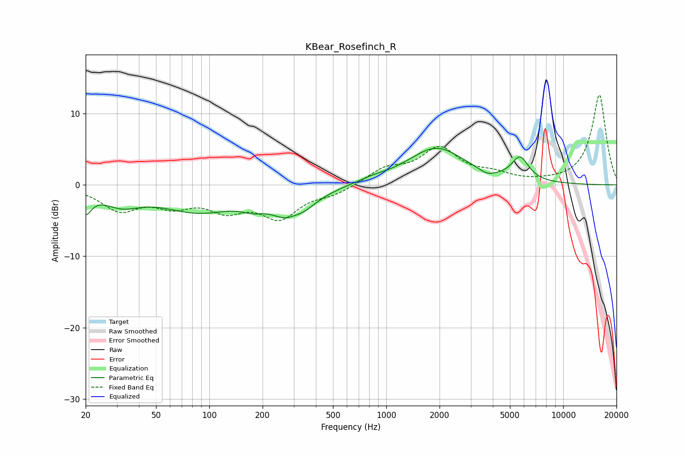

# KBear_Rosefinch_R
See [usage instructions](https://github.com/jaakkopasanen/AutoEq#usage) for more options and info.

### Parametric EQs
Apply preamp of -5.2 dB when using parametric equalizer.

|   # | Type    |   Fc (Hz) |    Q |   Gain (dB) |
|-----|---------|-----------|------|-------------|
|   1 | Peaking |        20 | 4.33 |        -2.9 |
|   2 | Peaking |        32 | 1.32 |        -2.2 |
|   3 | Peaking |        87 | 0.66 |        -3.5 |
|   4 | Peaking |       175 | 2.2  |        -1   |
|   5 | Peaking |       295 | 1.36 |        -4.6 |
|   6 | Peaking |       301 | 3    |         0.9 |
|   7 | Peaking |       842 | 1.72 |         0.4 |
|   8 | Peaking |      1919 | 0.87 |         5.1 |
|   9 | Peaking |      3732 | 3.06 |        -0.7 |
|  10 | Peaking |      5706 | 2.89 |         3.2 |

### Fixed Band EQs
When using fixed band (also called graphic) equalizer, apply preamp of **-12.7 dB** (if available) and set gains manually with these parameters.

|   # | Type    |   Fc (Hz) |    Q |   Gain (dB) |
|-----|---------|-----------|------|-------------|
|   1 | Peaking |        31 | 1.41 |        -3.3 |
|   2 | Peaking |        62 | 1.41 |        -2.4 |
|   3 | Peaking |       125 | 1.41 |        -3   |
|   4 | Peaking |       250 | 1.41 |        -4.3 |
|   5 | Peaking |       500 | 1.41 |        -1.1 |
|   6 | Peaking |      1000 | 1.41 |         2.1 |
|   7 | Peaking |      2000 | 1.41 |         4.9 |
|   8 | Peaking |      4000 | 1.41 |         1.2 |
|   9 | Peaking |      8000 | 1.41 |         0.2 |
|  10 | Peaking |     16000 | 1.41 |        12.6 |

### Graphs

