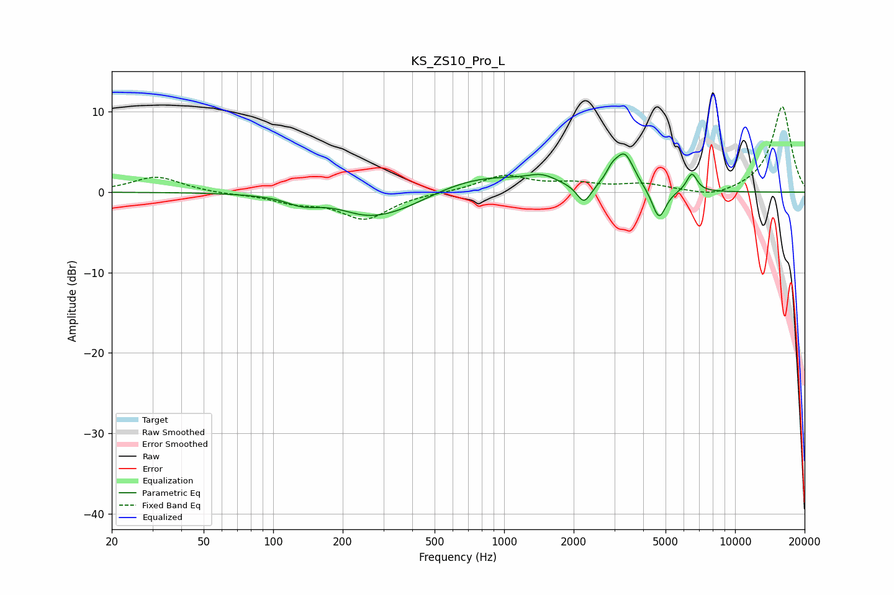

# KS_ZS10_Pro_L
See [usage instructions](https://github.com/jaakkopasanen/AutoEq#usage) for more options and info.

### Parametric EQs
Apply preamp of -4.8 dB when using parametric equalizer.

|   # | Type    |   Fc (Hz) |    Q |   Gain (dB) |
|-----|---------|-----------|------|-------------|
|   1 | Peaking |       134 | 2.08 |        -1   |
|   2 | Peaking |       250 | 1.55 |        -0.8 |
|   3 | Peaking |       319 | 0.75 |        -3   |
|   4 | Peaking |       772 | 0.6  |         2.4 |
|   5 | Peaking |      1462 | 2.28 |         1   |
|   6 | Peaking |      2217 | 4.63 |        -2.4 |
|   7 | Peaking |      2928 | 5.73 |         1.1 |
|   8 | Peaking |      3321 | 3.29 |         4.5 |
|   9 | Peaking |      4683 | 4.66 |        -3.9 |
|  10 | Peaking |      6501 | 6    |         2.3 |

### Fixed Band EQs
When using fixed band (also called graphic) equalizer, apply preamp of **-10.7 dB** (if available) and set gains manually with these parameters.

|   # | Type    |   Fc (Hz) |    Q |   Gain (dB) |
|-----|---------|-----------|------|-------------|
|   1 | Peaking |        31 | 1.41 |         1.9 |
|   2 | Peaking |        62 | 1.41 |        -0.2 |
|   3 | Peaking |       125 | 1.41 |        -1.1 |
|   4 | Peaking |       250 | 1.41 |        -3.2 |
|   5 | Peaking |       500 | 1.41 |        -0   |
|   6 | Peaking |      1000 | 1.41 |         2   |
|   7 | Peaking |      2000 | 1.41 |         0.9 |
|   8 | Peaking |      4000 | 1.41 |         0.9 |
|   9 | Peaking |      8000 | 1.41 |        -0.8 |
|  10 | Peaking |     16000 | 1.41 |        10.7 |

### Graphs

