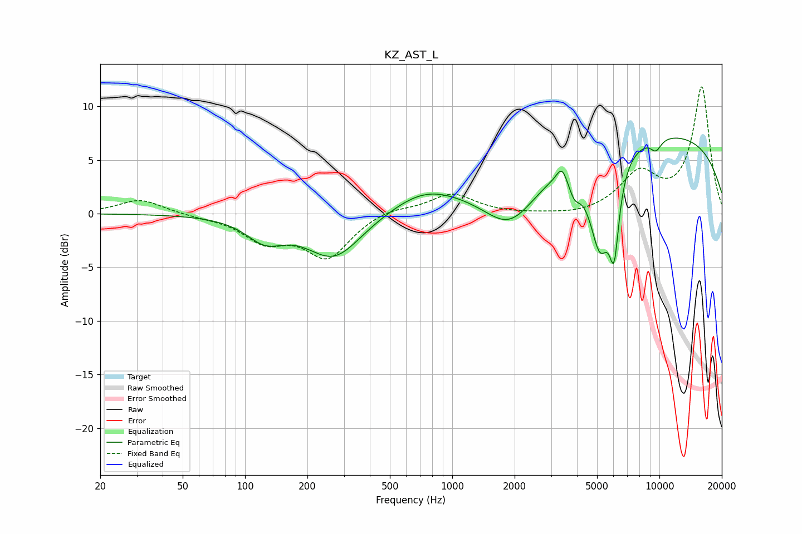

# KZ_AST_L
See [usage instructions](https://github.com/jaakkopasanen/AutoEq#usage) for more options and info.

### Parametric EQs
Apply preamp of -7.1 dB when using parametric equalizer.

|   # | Type    |   Fc (Hz) |    Q |   Gain (dB) |
|-----|---------|-----------|------|-------------|
|   1 | Peaking |       125 | 1.54 |        -2.1 |
|   2 | Peaking |       269 | 1.06 |        -4.1 |
|   3 | Peaking |       730 | 0.89 |         1.9 |
|   4 | Peaking |      1915 | 1.05 |        -4.9 |
|   5 | Peaking |      3387 | 5.28 |         1.5 |
|   6 | Peaking |      3882 | 4.61 |        -1.8 |
|   7 | Peaking |      5168 | 2.53 |        -9   |
|   8 | Peaking |      6049 | 5.94 |        -6.7 |
|   9 | Peaking |      8319 | 0.18 |         7.8 |
|  10 | Peaking |      9616 | 4.63 |        -1.1 |

### Fixed Band EQs
When using fixed band (also called graphic) equalizer, apply preamp of **-11.9 dB** (if available) and set gains manually with these parameters.

|   # | Type    |   Fc (Hz) |    Q |   Gain (dB) |
|-----|---------|-----------|------|-------------|
|   1 | Peaking |        31 | 1.41 |         1.4 |
|   2 | Peaking |        62 | 1.41 |        -0.2 |
|   3 | Peaking |       125 | 1.41 |        -2.3 |
|   4 | Peaking |       250 | 1.41 |        -4   |
|   5 | Peaking |       500 | 1.41 |         0.6 |
|   6 | Peaking |      1000 | 1.41 |         1.9 |
|   7 | Peaking |      2000 | 1.41 |        -0.1 |
|   8 | Peaking |      4000 | 1.41 |        -0.3 |
|   9 | Peaking |      8000 | 1.41 |         3.5 |
|  10 | Peaking |     16000 | 1.41 |        11.7 |

### Graphs

