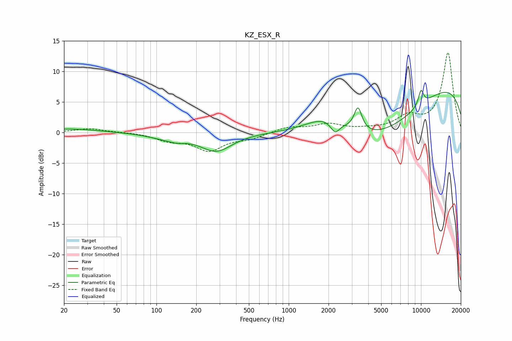

# KZ_ESX_R
See [usage instructions](https://github.com/jaakkopasanen/AutoEq#usage) for more options and info.

### Parametric EQs
Apply preamp of -7.0 dB when using parametric equalizer.

|   # | Type    |   Fc (Hz) |    Q |   Gain (dB) |
|-----|---------|-----------|------|-------------|
|   1 | Peaking |        22 | 0.66 |         0.6 |
|   2 | Peaking |       124 | 1.05 |        -0.9 |
|   3 | Peaking |       145 | 3.47 |        -0.3 |
|   4 | Peaking |       284 | 1.2  |        -2.9 |
|   5 | Peaking |      1963 | 0.88 |         3.1 |
|   6 | Peaking |      2243 | 3.92 |        -2   |
|   7 | Peaking |      3341 | 4.88 |         3.8 |
|   8 | Peaking |      4597 | 0.38 |        -8.9 |
|   9 | Peaking |      9568 | 0.18 |         9.6 |
|  10 | Peaking |     10000 | 6    |         2.5 |

### Fixed Band EQs
When using fixed band (also called graphic) equalizer, apply preamp of **-13.2 dB** (if available) and set gains manually with these parameters.

|   # | Type    |   Fc (Hz) |    Q |   Gain (dB) |
|-----|---------|-----------|------|-------------|
|   1 | Peaking |        31 | 1.41 |         0.7 |
|   2 | Peaking |        62 | 1.41 |         0.1 |
|   3 | Peaking |       125 | 1.41 |        -1.2 |
|   4 | Peaking |       250 | 1.41 |        -2.8 |
|   5 | Peaking |       500 | 1.41 |        -0.9 |
|   6 | Peaking |      1000 | 1.41 |         0.9 |
|   7 | Peaking |      2000 | 1.41 |         1.3 |
|   8 | Peaking |      4000 | 1.41 |         0.4 |
|   9 | Peaking |      8000 | 1.41 |         2.3 |
|  10 | Peaking |     16000 | 1.41 |        13.1 |

### Graphs

