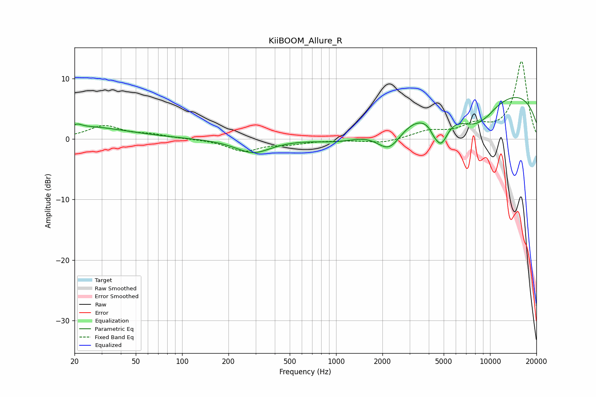

# KiiBOOM_Allure_R
See [usage instructions](https://github.com/jaakkopasanen/AutoEq#usage) for more options and info.

### Parametric EQs
Apply preamp of -7.0 dB when using parametric equalizer.

|   # | Type    |   Fc (Hz) |    Q |   Gain (dB) |
|-----|---------|-----------|------|-------------|
|   1 | Peaking |        21 | 5.95 |         0.4 |
|   2 | Peaking |        22 | 0.47 |         2.1 |
|   3 | Peaking |       289 | 1.24 |        -2.3 |
|   4 | Peaking |      1076 | 0.9  |        -1.3 |
|   5 | Peaking |      2218 | 1.64 |        -4.7 |
|   6 | Peaking |      4291 | 6    |        -0.6 |
|   7 | Peaking |      4787 | 2.86 |        -5.1 |
|   8 | Peaking |      8061 | 0.91 |        -5.7 |
|   9 | Peaking |      9725 | 0.19 |         8.9 |
|  10 | Peaking |      9729 | 5.93 |        -0.1 |

### Fixed Band EQs
When using fixed band (also called graphic) equalizer, apply preamp of **-12.9 dB** (if available) and set gains manually with these parameters.

|   # | Type    |   Fc (Hz) |    Q |   Gain (dB) |
|-----|---------|-----------|------|-------------|
|   1 | Peaking |        31 | 1.41 |         2.1 |
|   2 | Peaking |        62 | 1.41 |         0.6 |
|   3 | Peaking |       125 | 1.41 |         0   |
|   4 | Peaking |       250 | 1.41 |        -1.9 |
|   5 | Peaking |       500 | 1.41 |        -0.7 |
|   6 | Peaking |      1000 | 1.41 |        -0.1 |
|   7 | Peaking |      2000 | 1.41 |        -0.7 |
|   8 | Peaking |      4000 | 1.41 |         1.2 |
|   9 | Peaking |      8000 | 1.41 |         2   |
|  10 | Peaking |     16000 | 1.41 |        12.8 |

### Graphs

