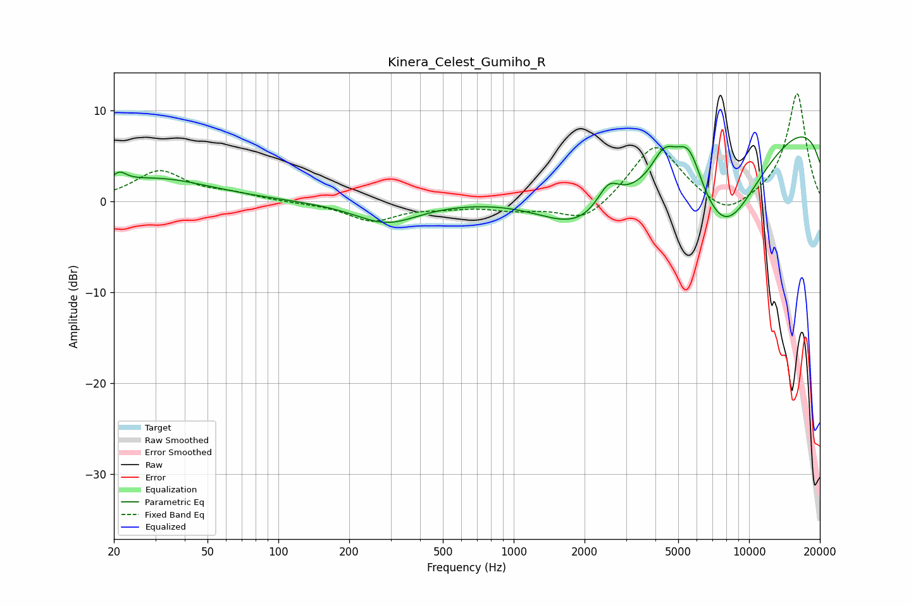

# Kinera_Celest_Gumiho_R
See [usage instructions](https://github.com/jaakkopasanen/AutoEq#usage) for more options and info.

### Parametric EQs
Apply preamp of -7.2 dB when using parametric equalizer.

|   # | Type    |   Fc (Hz) |    Q |   Gain (dB) |
|-----|---------|-----------|------|-------------|
|   1 | Peaking |        21 | 5.46 |         2.7 |
|   2 | Peaking |        21 | 6    |        -1.6 |
|   3 | Peaking |        30 | 0.6  |         2.5 |
|   4 | Peaking |       288 | 1.04 |        -2.4 |
|   5 | Peaking |      1934 | 0.72 |        -6.1 |
|   6 | Peaking |      2524 | 2.94 |         2.7 |
|   7 | Peaking |      4353 | 2.62 |         3.5 |
|   8 | Peaking |      5548 | 2.32 |         5.5 |
|   9 | Peaking |      7818 | 0.56 |       -16.5 |
|  10 | Peaking |      9637 | 0.18 |        14.3 |

### Fixed Band EQs
When using fixed band (also called graphic) equalizer, apply preamp of **-11.9 dB** (if available) and set gains manually with these parameters.

|   # | Type    |   Fc (Hz) |    Q |   Gain (dB) |
|-----|---------|-----------|------|-------------|
|   1 | Peaking |        31 | 1.41 |         3.3 |
|   2 | Peaking |        62 | 1.41 |         0.7 |
|   3 | Peaking |       125 | 1.41 |        -0.1 |
|   4 | Peaking |       250 | 1.41 |        -2.1 |
|   5 | Peaking |       500 | 1.41 |        -0.5 |
|   6 | Peaking |      1000 | 1.41 |        -0.8 |
|   7 | Peaking |      2000 | 1.41 |        -2.4 |
|   8 | Peaking |      4000 | 1.41 |         6.5 |
|   9 | Peaking |      8000 | 1.41 |        -2.1 |
|  10 | Peaking |     16000 | 1.41 |        12   |

### Graphs

