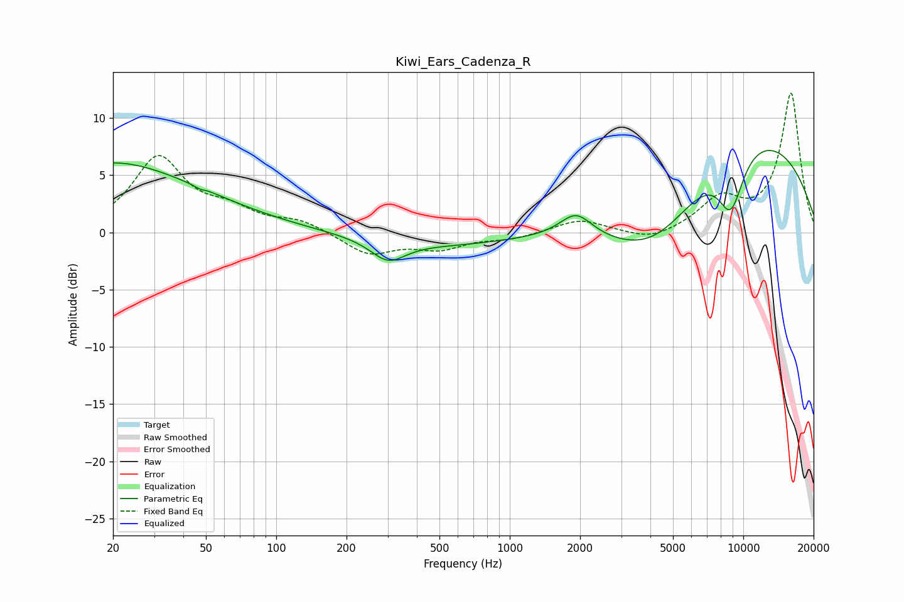

# Kiwi_Ears_Cadenza_R
See [usage instructions](https://github.com/jaakkopasanen/AutoEq#usage) for more options and info.

### Parametric EQs
Apply preamp of -7.3 dB when using parametric equalizer.

|   # | Type    |   Fc (Hz) |    Q |   Gain (dB) |
|-----|---------|-----------|------|-------------|
|   1 | Peaking |        20 | 0.33 |         5.2 |
|   2 | Peaking |        20 | 0.73 |         0.9 |
|   3 | Peaking |        48 | 5.63 |        -1.2 |
|   4 | Peaking |        49 | 5.57 |         1   |
|   5 | Peaking |       301 | 1.9  |        -1.9 |
|   6 | Peaking |       556 | 0.43 |        -1.1 |
|   7 | Peaking |      1923 | 2.05 |         2.1 |
|   8 | Peaking |      4268 | 0.46 |       -11.8 |
|   9 | Peaking |      7440 | 0.27 |        13.9 |
|  10 | Peaking |      8840 | 2.29 |        -5   |

### Fixed Band EQs
When using fixed band (also called graphic) equalizer, apply preamp of **-12.3 dB** (if available) and set gains manually with these parameters.

|   # | Type    |   Fc (Hz) |    Q |   Gain (dB) |
|-----|---------|-----------|------|-------------|
|   1 | Peaking |        31 | 1.41 |         6.4 |
|   2 | Peaking |        62 | 1.41 |         1.6 |
|   3 | Peaking |       125 | 1.41 |         0.9 |
|   4 | Peaking |       250 | 1.41 |        -1.9 |
|   5 | Peaking |       500 | 1.41 |        -1.3 |
|   6 | Peaking |      1000 | 1.41 |        -0.5 |
|   7 | Peaking |      2000 | 1.41 |         1.2 |
|   8 | Peaking |      4000 | 1.41 |        -0.9 |
|   9 | Peaking |      8000 | 1.41 |         2.7 |
|  10 | Peaking |     16000 | 1.41 |        12.1 |

### Graphs

