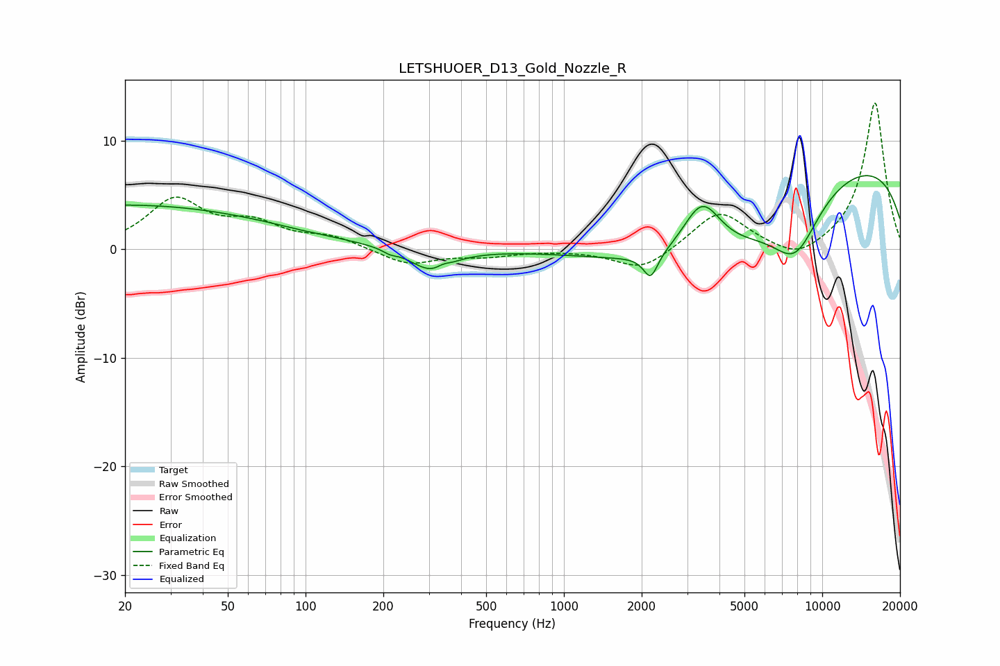

# LETSHUOER_D13_Gold_Nozzle_R
See [usage instructions](https://github.com/jaakkopasanen/AutoEq#usage) for more options and info.

### Parametric EQs
Apply preamp of -6.9 dB when using parametric equalizer.

|   # | Type    |   Fc (Hz) |    Q |   Gain (dB) |
|-----|---------|-----------|------|-------------|
|   1 | Peaking |        20 | 0.23 |         4.1 |
|   2 | Peaking |        92 | 4.57 |        -0   |
|   3 | Peaking |       211 | 5.52 |        -0.3 |
|   4 | Peaking |       306 | 1.76 |        -2.1 |
|   5 | Peaking |       340 | 5.81 |         0.3 |
|   6 | Peaking |      2167 | 5.14 |        -2.2 |
|   7 | Peaking |      3421 | 1.79 |         5.6 |
|   8 | Peaking |      3619 | 0.44 |        -8   |
|   9 | Peaking |      7875 | 1.42 |        -5   |
|  10 | Peaking |      9458 | 0.18 |         9   |

### Fixed Band EQs
When using fixed band (also called graphic) equalizer, apply preamp of **-13.6 dB** (if available) and set gains manually with these parameters.

|   # | Type    |   Fc (Hz) |    Q |   Gain (dB) |
|-----|---------|-----------|------|-------------|
|   1 | Peaking |        31 | 1.41 |         4.4 |
|   2 | Peaking |        62 | 1.41 |         2   |
|   3 | Peaking |       125 | 1.41 |         1   |
|   4 | Peaking |       250 | 1.41 |        -1.4 |
|   5 | Peaking |       500 | 1.41 |        -0.6 |
|   6 | Peaking |      1000 | 1.41 |        -0   |
|   7 | Peaking |      2000 | 1.41 |        -2   |
|   8 | Peaking |      4000 | 1.41 |         3.6 |
|   9 | Peaking |      8000 | 1.41 |        -1.4 |
|  10 | Peaking |     16000 | 1.41 |        13.6 |

### Graphs

