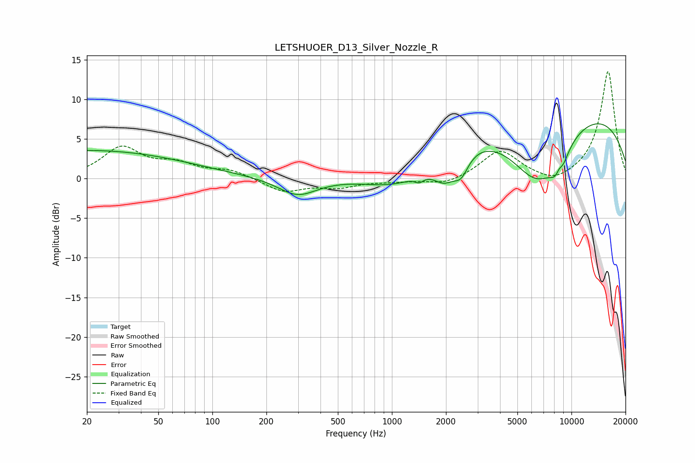

# LETSHUOER_D13_Silver_Nozzle_R
See [usage instructions](https://github.com/jaakkopasanen/AutoEq#usage) for more options and info.

### Parametric EQs
Apply preamp of -7.0 dB when using parametric equalizer.

|   # | Type    |   Fc (Hz) |    Q |   Gain (dB) |
|-----|---------|-----------|------|-------------|
|   1 | Peaking |        20 | 0.25 |         3.5 |
|   2 | Peaking |       298 | 1.31 |        -2.2 |
|   3 | Peaking |      1083 | 0.78 |        -2.9 |
|   4 | Peaking |      1418 | 5.93 |        -0.7 |
|   5 | Peaking |      1969 | 2.08 |        -3.1 |
|   6 | Peaking |      2432 | 3.4  |        -2.4 |
|   7 | Peaking |      6410 | 0.84 |        -9   |
|   8 | Peaking |      7904 | 0.18 |         9.9 |
|   9 | Peaking |      8522 | 3.59 |        -5.7 |
|  10 | Peaking |      8538 | 5.33 |         3.6 |

### Fixed Band EQs
When using fixed band (also called graphic) equalizer, apply preamp of **-13.6 dB** (if available) and set gains manually with these parameters.

|   # | Type    |   Fc (Hz) |    Q |   Gain (dB) |
|-----|---------|-----------|------|-------------|
|   1 | Peaking |        31 | 1.41 |         3.8 |
|   2 | Peaking |        62 | 1.41 |         1.6 |
|   3 | Peaking |       125 | 1.41 |         1   |
|   4 | Peaking |       250 | 1.41 |        -1.7 |
|   5 | Peaking |       500 | 1.41 |        -1   |
|   6 | Peaking |      1000 | 1.41 |        -0.3 |
|   7 | Peaking |      2000 | 1.41 |        -0.8 |
|   8 | Peaking |      4000 | 1.41 |         3.5 |
|   9 | Peaking |      8000 | 1.41 |        -1   |
|  10 | Peaking |     16000 | 1.41 |        13.6 |

### Graphs

