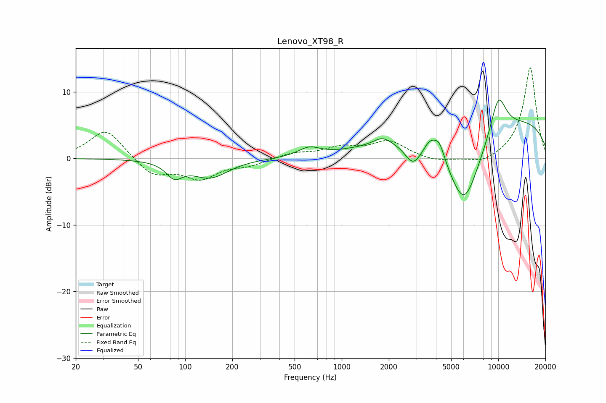

# Lenovo_XT98_R
See [usage instructions](https://github.com/jaakkopasanen/AutoEq#usage) for more options and info.

### Parametric EQs
Apply preamp of -8.9 dB when using parametric equalizer.

|   # | Type    |   Fc (Hz) |    Q |   Gain (dB) |
|-----|---------|-----------|------|-------------|
|   1 | Peaking |        85 | 2.74 |        -2.2 |
|   2 | Peaking |       144 | 1.22 |        -2.8 |
|   3 | Peaking |       619 | 2.12 |         1.3 |
|   4 | Peaking |      1814 | 2.67 |         1.1 |
|   5 | Peaking |      2857 | 2.59 |        -3.2 |
|   6 | Peaking |      3664 | 3.56 |         1.8 |
|   7 | Peaking |      4200 | 3.97 |         2.6 |
|   8 | Peaking |      6045 | 1.14 |       -12.7 |
|   9 | Peaking |      9019 | 0.18 |         6.7 |
|  10 | Peaking |     10000 | 2.3  |         6.1 |

### Fixed Band EQs
When using fixed band (also called graphic) equalizer, apply preamp of **-13.7 dB** (if available) and set gains manually with these parameters.

|   # | Type    |   Fc (Hz) |    Q |   Gain (dB) |
|-----|---------|-----------|------|-------------|
|   1 | Peaking |        31 | 1.41 |         4.5 |
|   2 | Peaking |        62 | 1.41 |        -2.6 |
|   3 | Peaking |       125 | 1.41 |        -2.8 |
|   4 | Peaking |       250 | 1.41 |        -0.9 |
|   5 | Peaking |       500 | 1.41 |         0.8 |
|   6 | Peaking |      1000 | 1.41 |         1.5 |
|   7 | Peaking |      2000 | 1.41 |         2.5 |
|   8 | Peaking |      4000 | 1.41 |        -0.6 |
|   9 | Peaking |      8000 | 1.41 |        -1   |
|  10 | Peaking |     16000 | 1.41 |        13.8 |

### Graphs

