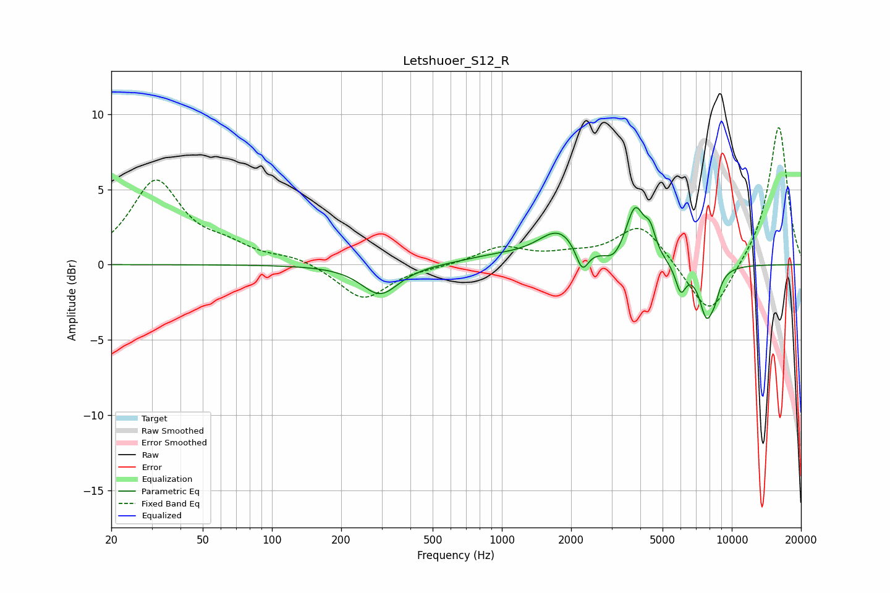

# Letshuoer_S12_R
See [usage instructions](https://github.com/jaakkopasanen/AutoEq#usage) for more options and info.

### Parametric EQs
Apply preamp of -3.9 dB when using parametric equalizer.

|   # | Type    |   Fc (Hz) |    Q |   Gain (dB) |
|-----|---------|-----------|------|-------------|
|   1 | Peaking |       295 | 1.75 |        -2   |
|   2 | Peaking |       933 | 0.96 |         0.4 |
|   3 | Peaking |      1772 | 1.56 |         2.1 |
|   4 | Peaking |      2235 | 5.15 |        -1.7 |
|   5 | Peaking |      3079 | 3.66 |        -0.7 |
|   6 | Peaking |      3800 | 3.48 |         3.6 |
|   7 | Peaking |      4417 | 6    |         1.4 |
|   8 | Peaking |      5997 | 6    |        -1.8 |
|   9 | Peaking |      7767 | 4.12 |        -3.3 |
|  10 | Peaking |      8465 | 6    |        -0.9 |

### Fixed Band EQs
When using fixed band (also called graphic) equalizer, apply preamp of **-9.2 dB** (if available) and set gains manually with these parameters.

|   # | Type    |   Fc (Hz) |    Q |   Gain (dB) |
|-----|---------|-----------|------|-------------|
|   1 | Peaking |        31 | 1.41 |         5.5 |
|   2 | Peaking |        62 | 1.41 |         0.9 |
|   3 | Peaking |       125 | 1.41 |         0.5 |
|   4 | Peaking |       250 | 1.41 |        -2.4 |
|   5 | Peaking |       500 | 1.41 |        -0.1 |
|   6 | Peaking |      1000 | 1.41 |         1.1 |
|   7 | Peaking |      2000 | 1.41 |         0.5 |
|   8 | Peaking |      4000 | 1.41 |         2.7 |
|   9 | Peaking |      8000 | 1.41 |        -3.7 |
|  10 | Peaking |     16000 | 1.41 |         9.3 |

### Graphs

