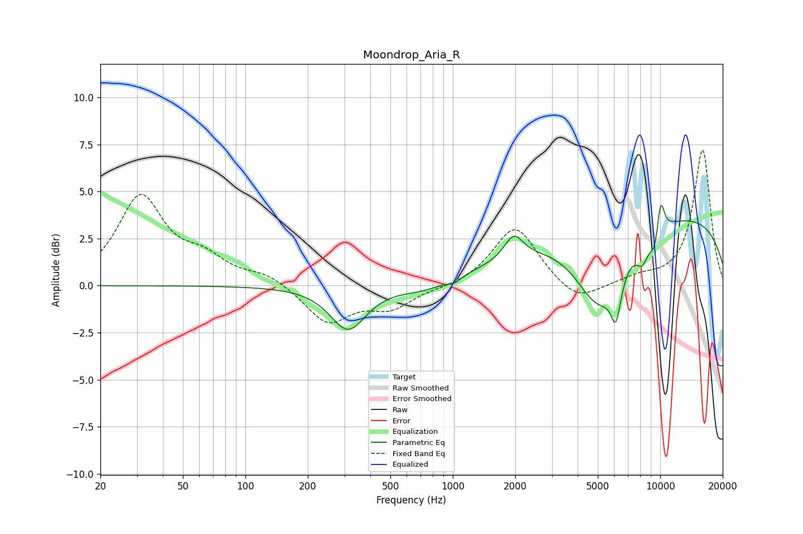

# Moondrop_Aria_R
See [usage instructions](https://github.com/jaakkopasanen/AutoEq#usage) for more options and info.

### Parametric EQs
Apply preamp of -4.3 dB when using parametric equalizer.

|   # | Type    |   Fc (Hz) |    Q |   Gain (dB) |
|-----|---------|-----------|------|-------------|
|   1 | Peaking |       313 | 1.65 |        -2.3 |
|   2 | Peaking |       725 | 1.23 |        -0.4 |
|   3 | Peaking |      1015 | 4.77 |        -0.3 |
|   4 | Peaking |      1968 | 3.2  |         1.2 |
|   5 | Peaking |      5100 | 1.19 |        -4.3 |
|   6 | Peaking |      6115 | 5.72 |        -2.1 |
|   7 | Peaking |      8186 | 4.79 |        -1   |
|   8 | Peaking |      9411 | 0.18 |         3.9 |
|   9 | Peaking |      9597 | 4.25 |        -1.9 |
|  10 | Peaking |     10000 | 6    |         2.7 |

### Fixed Band EQs
When using fixed band (also called graphic) equalizer, apply preamp of **-7.3 dB** (if available) and set gains manually with these parameters.

|   # | Type    |   Fc (Hz) |    Q |   Gain (dB) |
|-----|---------|-----------|------|-------------|
|   1 | Peaking |        31 | 1.41 |         4.6 |
|   2 | Peaking |        62 | 1.41 |         1.2 |
|   3 | Peaking |       125 | 1.41 |         0.6 |
|   4 | Peaking |       250 | 1.41 |        -2   |
|   5 | Peaking |       500 | 1.41 |        -1.1 |
|   6 | Peaking |      1000 | 1.41 |        -0.1 |
|   7 | Peaking |      2000 | 1.41 |         3.2 |
|   8 | Peaking |      4000 | 1.41 |        -1   |
|   9 | Peaking |      8000 | 1.41 |         0.4 |
|  10 | Peaking |     16000 | 1.41 |         7.2 |

### Graphs

