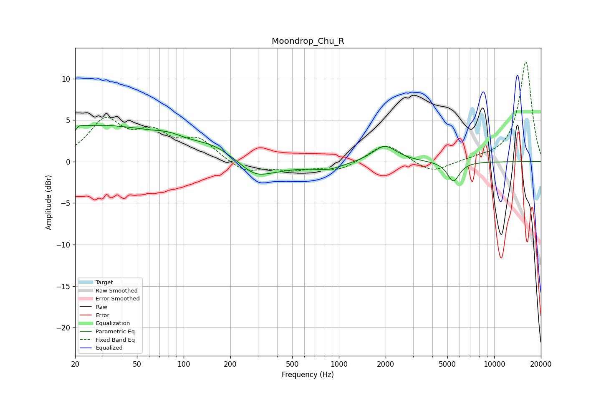

# Moondrop_Chu_R
See [usage instructions](https://github.com/jaakkopasanen/AutoEq#usage) for more options and info.

### Parametric EQs
Apply preamp of -4.5 dB when using parametric equalizer.

|   # | Type    |   Fc (Hz) |    Q |   Gain (dB) |
|-----|---------|-----------|------|-------------|
|   1 | Peaking |        20 | 5.94 |        -3.6 |
|   2 | Peaking |        20 | 5.8  |         3.1 |
|   3 | Peaking |        27 | 0.3  |         4.3 |
|   4 | Peaking |        80 | 1.57 |         0.6 |
|   5 | Peaking |       161 | 0.95 |         1.5 |
|   6 | Peaking |       287 | 1.74 |        -0.9 |
|   7 | Peaking |       305 | 0.71 |        -1.6 |
|   8 | Peaking |       853 | 1.48 |        -0.8 |
|   9 | Peaking |      1972 | 1.83 |         2   |
|  10 | Peaking |      5463 | 3.56 |        -2.4 |

### Fixed Band EQs
When using fixed band (also called graphic) equalizer, apply preamp of **-12.1 dB** (if available) and set gains manually with these parameters.

|   # | Type    |   Fc (Hz) |    Q |   Gain (dB) |
|-----|---------|-----------|------|-------------|
|   1 | Peaking |        31 | 1.41 |         4.7 |
|   2 | Peaking |        62 | 1.41 |         2.9 |
|   3 | Peaking |       125 | 1.41 |         2.4 |
|   4 | Peaking |       250 | 1.41 |        -1.4 |
|   5 | Peaking |       500 | 1.41 |        -0.9 |
|   6 | Peaking |      1000 | 1.41 |        -1.1 |
|   7 | Peaking |      2000 | 1.41 |         2.3 |
|   8 | Peaking |      4000 | 1.41 |        -1.4 |
|   9 | Peaking |      8000 | 1.41 |         0.2 |
|  10 | Peaking |     16000 | 1.41 |        12.1 |

### Graphs

