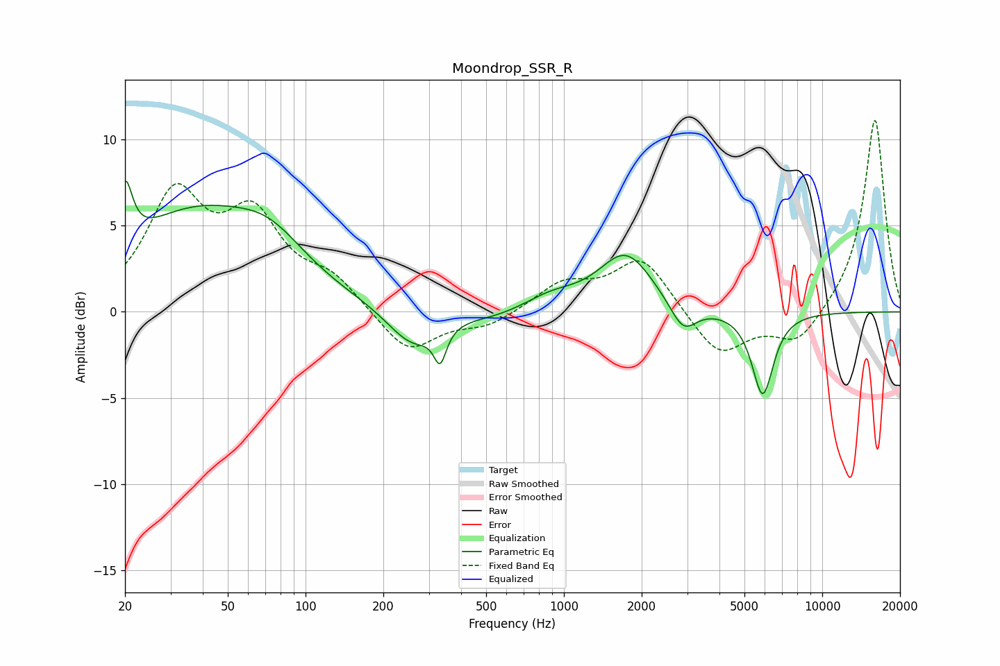

# Moondrop_SSR_R
See [usage instructions](https://github.com/jaakkopasanen/AutoEq#usage) for more options and info.

### Parametric EQs
Apply preamp of -7.7 dB when using parametric equalizer.

|   # | Type    |   Fc (Hz) |    Q |   Gain (dB) |
|-----|---------|-----------|------|-------------|
|   1 | Peaking |        20 | 5.18 |         3.7 |
|   2 | Peaking |        37 | 0.5  |         5.4 |
|   3 | Peaking |        73 | 1.04 |         2   |
|   4 | Peaking |       259 | 1.45 |        -2.2 |
|   5 | Peaking |       332 | 5.97 |        -1.9 |
|   6 | Peaking |       539 | 1.15 |        -0.4 |
|   7 | Peaking |       895 | 1.36 |         0.8 |
|   8 | Peaking |      1737 | 1.36 |         3.4 |
|   9 | Peaking |      2896 | 2.75 |        -1.7 |
|  10 | Peaking |      5884 | 3.32 |        -4.8 |

### Fixed Band EQs
When using fixed band (also called graphic) equalizer, apply preamp of **-11.2 dB** (if available) and set gains manually with these parameters.

|   # | Type    |   Fc (Hz) |    Q |   Gain (dB) |
|-----|---------|-----------|------|-------------|
|   1 | Peaking |        31 | 1.41 |         6.4 |
|   2 | Peaking |        62 | 1.41 |         4.9 |
|   3 | Peaking |       125 | 1.41 |         1.7 |
|   4 | Peaking |       250 | 1.41 |        -2.5 |
|   5 | Peaking |       500 | 1.41 |        -0.8 |
|   6 | Peaking |      1000 | 1.41 |         1.6 |
|   7 | Peaking |      2000 | 1.41 |         3.1 |
|   8 | Peaking |      4000 | 1.41 |        -2.6 |
|   9 | Peaking |      8000 | 1.41 |        -1.9 |
|  10 | Peaking |     16000 | 1.41 |        11.3 |

### Graphs

