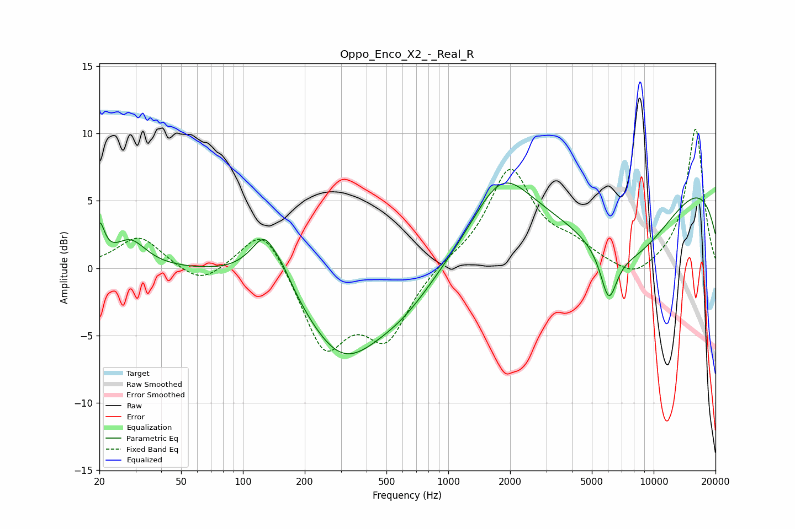

# Oppo_Enco_X2_-_Real_R
See [usage instructions](https://github.com/jaakkopasanen/AutoEq#usage) for more options and info.

### Parametric EQs
Apply preamp of -6.4 dB when using parametric equalizer.

|   # | Type    |   Fc (Hz) |    Q |   Gain (dB) |
|-----|---------|-----------|------|-------------|
|   1 | Peaking |        20 | 5.73 |         2.7 |
|   2 | Peaking |        28 | 1.88 |         2   |
|   3 | Peaking |       135 | 1.92 |         5.5 |
|   4 | Peaking |       139 | 3.46 |        -1.5 |
|   5 | Peaking |       305 | 0.74 |        -6.2 |
|   6 | Peaking |       604 | 0.86 |        -2   |
|   7 | Peaking |      1808 | 1.02 |         4.5 |
|   8 | Peaking |      6043 | 3.47 |        -3.6 |
|   9 | Peaking |      7554 | 0.48 |        -7.9 |
|  10 | Peaking |      9551 | 0.19 |         9.1 |

### Fixed Band EQs
When using fixed band (also called graphic) equalizer, apply preamp of **-10.4 dB** (if available) and set gains manually with these parameters.

|   # | Type    |   Fc (Hz) |    Q |   Gain (dB) |
|-----|---------|-----------|------|-------------|
|   1 | Peaking |        31 | 1.41 |         2.4 |
|   2 | Peaking |        62 | 1.41 |        -1.4 |
|   3 | Peaking |       125 | 1.41 |         3.5 |
|   4 | Peaking |       250 | 1.41 |        -5.9 |
|   5 | Peaking |       500 | 1.41 |        -4.9 |
|   6 | Peaking |      1000 | 1.41 |         0.5 |
|   7 | Peaking |      2000 | 1.41 |         7.2 |
|   8 | Peaking |      4000 | 1.41 |         1.3 |
|   9 | Peaking |      8000 | 1.41 |        -1.1 |
|  10 | Peaking |     16000 | 1.41 |        10.4 |

### Graphs

