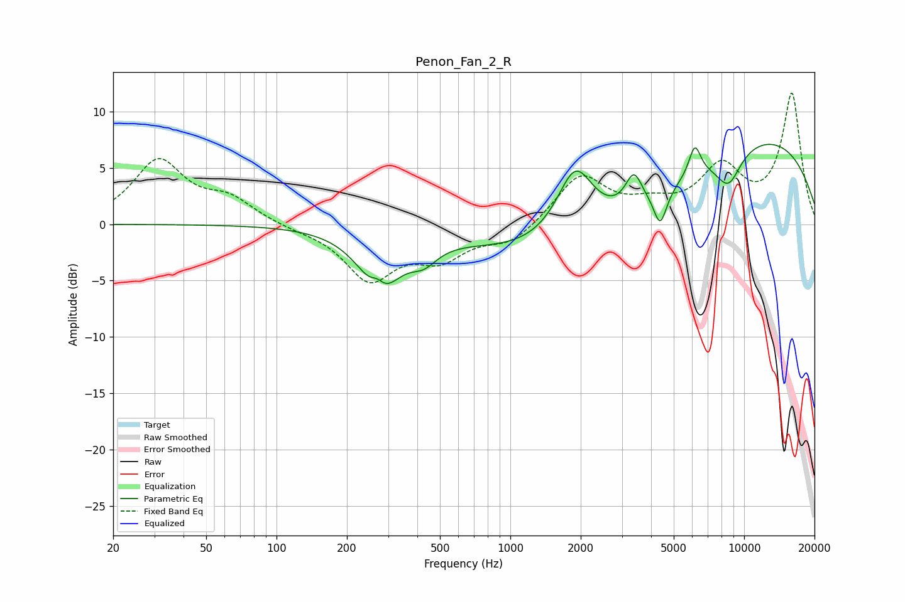

# Penon_Fan_2_R
See [usage instructions](https://github.com/jaakkopasanen/AutoEq#usage) for more options and info.

### Parametric EQs
Apply preamp of -7.2 dB when using parametric equalizer.

|   # | Type    |   Fc (Hz) |    Q |   Gain (dB) |
|-----|---------|-----------|------|-------------|
|   1 | Peaking |       270 | 4.91 |         1   |
|   2 | Peaking |       276 | 1.62 |        -5.3 |
|   3 | Peaking |       427 | 2.43 |        -1.5 |
|   4 | Peaking |      1895 | 1.78 |         6.3 |
|   5 | Peaking |      3376 | 3.99 |         2.9 |
|   6 | Peaking |      3722 | 0.2  |        -4.8 |
|   7 | Peaking |      4377 | 5.05 |        -3.1 |
|   8 | Peaking |      6154 | 5.29 |         2.7 |
|   9 | Peaking |      8576 | 2.39 |        -3   |
|  10 | Peaking |     10000 | 0.29 |        10.6 |

### Fixed Band EQs
When using fixed band (also called graphic) equalizer, apply preamp of **-11.7 dB** (if available) and set gains manually with these parameters.

|   # | Type    |   Fc (Hz) |    Q |   Gain (dB) |
|-----|---------|-----------|------|-------------|
|   1 | Peaking |        31 | 1.41 |         5.5 |
|   2 | Peaking |        62 | 1.41 |         2   |
|   3 | Peaking |       125 | 1.41 |        -0.3 |
|   4 | Peaking |       250 | 1.41 |        -4.7 |
|   5 | Peaking |       500 | 1.41 |        -2.7 |
|   6 | Peaking |      1000 | 1.41 |        -1.7 |
|   7 | Peaking |      2000 | 1.41 |         4.3 |
|   8 | Peaking |      4000 | 1.41 |         1.3 |
|   9 | Peaking |      8000 | 1.41 |         4.7 |
|  10 | Peaking |     16000 | 1.41 |        11.5 |

### Graphs

