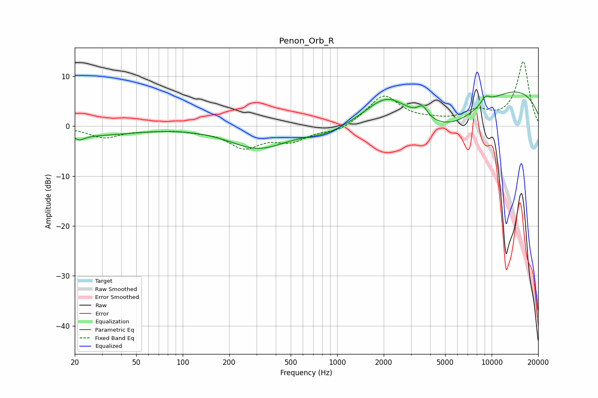

# Penon_Orb_R
See [usage instructions](https://github.com/jaakkopasanen/AutoEq#usage) for more options and info.

### Parametric EQs
Apply preamp of -6.9 dB when using parametric equalizer.

|   # | Type    |   Fc (Hz) |    Q |   Gain (dB) |
|-----|---------|-----------|------|-------------|
|   1 | Peaking |        21 | 4.59 |        -1.1 |
|   2 | Peaking |        25 | 3.34 |        -0.1 |
|   3 | Peaking |        28 | 0.57 |        -1.7 |
|   4 | Peaking |       308 | 0.76 |        -4.3 |
|   5 | Peaking |       855 | 1.03 |        -1.6 |
|   6 | Peaking |      2097 | 1.07 |         5.1 |
|   7 | Peaking |      3573 | 4.32 |         2.2 |
|   8 | Peaking |      5351 | 0.56 |        -7.9 |
|   9 | Peaking |      9115 | 4.13 |         1.5 |
|  10 | Peaking |     10000 | 0.23 |         9.2 |

### Fixed Band EQs
When using fixed band (also called graphic) equalizer, apply preamp of **-13.0 dB** (if available) and set gains manually with these parameters.

|   # | Type    |   Fc (Hz) |    Q |   Gain (dB) |
|-----|---------|-----------|------|-------------|
|   1 | Peaking |        31 | 1.41 |        -2.2 |
|   2 | Peaking |        62 | 1.41 |        -0.5 |
|   3 | Peaking |       125 | 1.41 |        -0.6 |
|   4 | Peaking |       250 | 1.41 |        -4   |
|   5 | Peaking |       500 | 1.41 |        -2.6 |
|   6 | Peaking |      1000 | 1.41 |        -1.2 |
|   7 | Peaking |      2000 | 1.41 |         6.1 |
|   8 | Peaking |      4000 | 1.41 |         0.7 |
|   9 | Peaking |      8000 | 1.41 |         2.5 |
|  10 | Peaking |     16000 | 1.41 |        12.9 |

### Graphs

