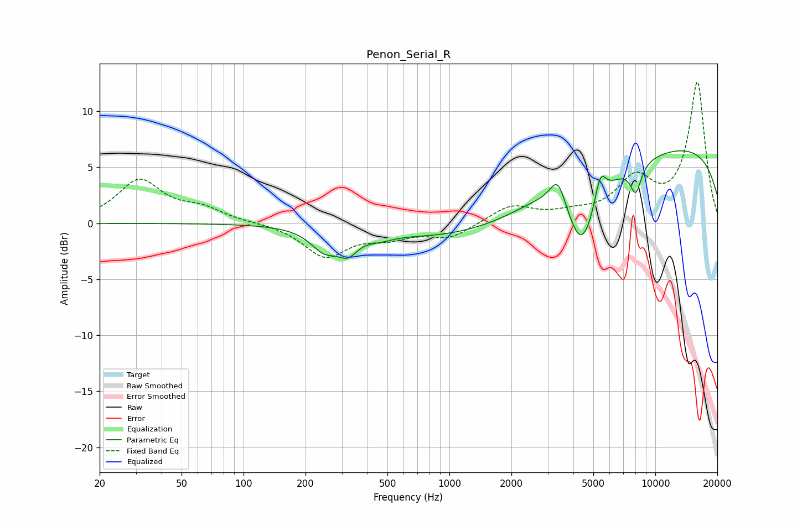

# Penon_Serial_R
See [usage instructions](https://github.com/jaakkopasanen/AutoEq#usage) for more options and info.

### Parametric EQs
Apply preamp of -6.6 dB when using parametric equalizer.

|   # | Type    |   Fc (Hz) |    Q |   Gain (dB) |
|-----|---------|-----------|------|-------------|
|   1 | Peaking |       247 | 2.11 |        -1.9 |
|   2 | Peaking |       321 | 2.94 |        -1.6 |
|   3 | Peaking |       456 | 2.08 |        -0.5 |
|   4 | Peaking |      2370 | 0.24 |        -2.5 |
|   5 | Peaking |      2718 | 1.26 |         0.6 |
|   6 | Peaking |      3364 | 3.63 |         2.7 |
|   7 | Peaking |      4403 | 1.91 |        -6   |
|   8 | Peaking |      5406 | 5.02 |         2.6 |
|   9 | Peaking |      8036 | 4.86 |        -2.5 |
|  10 | Peaking |     10000 | 0.19 |         7.4 |

### Fixed Band EQs
When using fixed band (also called graphic) equalizer, apply preamp of **-12.7 dB** (if available) and set gains manually with these parameters.

|   # | Type    |   Fc (Hz) |    Q |   Gain (dB) |
|-----|---------|-----------|------|-------------|
|   1 | Peaking |        31 | 1.41 |         3.8 |
|   2 | Peaking |        62 | 1.41 |         1.1 |
|   3 | Peaking |       125 | 1.41 |         0   |
|   4 | Peaking |       250 | 1.41 |        -2.9 |
|   5 | Peaking |       500 | 1.41 |        -1   |
|   6 | Peaking |      1000 | 1.41 |        -1.3 |
|   7 | Peaking |      2000 | 1.41 |         1.6 |
|   8 | Peaking |      4000 | 1.41 |         0.6 |
|   9 | Peaking |      8000 | 1.41 |         3.6 |
|  10 | Peaking |     16000 | 1.41 |        12.5 |

### Graphs

