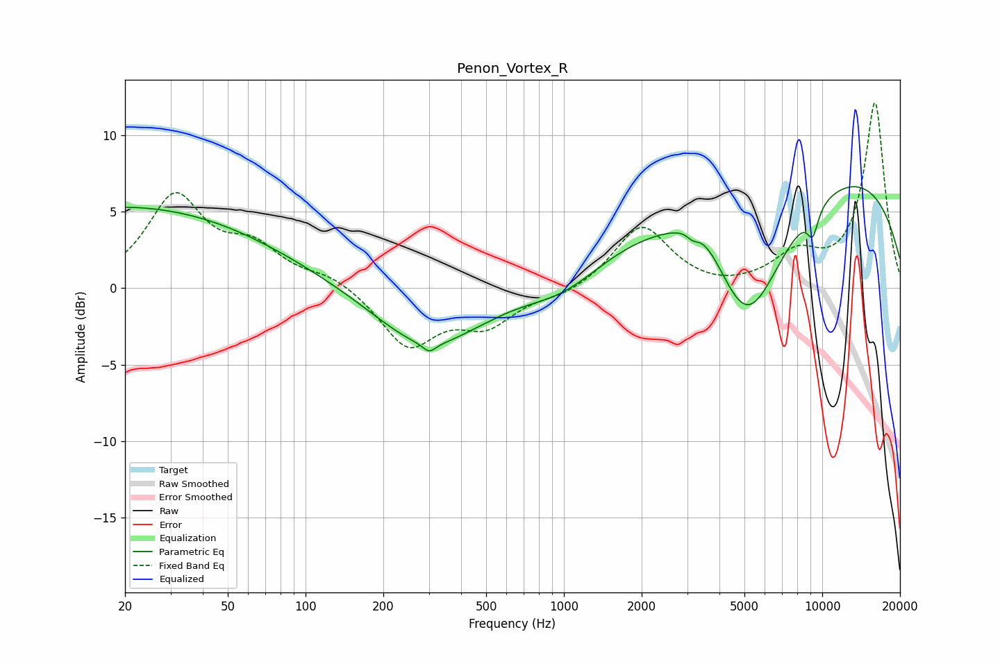

# Penon_Vortex_R
See [usage instructions](https://github.com/jaakkopasanen/AutoEq#usage) for more options and info.

### Parametric EQs
Apply preamp of -6.7 dB when using parametric equalizer.

|   # | Type    |   Fc (Hz) |    Q |   Gain (dB) |
|-----|---------|-----------|------|-------------|
|   1 | Peaking |        20 | 0.24 |         5.3 |
|   2 | Peaking |       297 | 0.69 |        -4   |
|   3 | Peaking |       301 | 5.95 |        -0.6 |
|   4 | Peaking |       518 | 5.67 |        -0   |
|   5 | Peaking |      1009 | 0.9  |        -1.7 |
|   6 | Peaking |      3157 | 5.98 |        -0.5 |
|   7 | Peaking |      3445 | 1.4  |         2.2 |
|   8 | Peaking |      5093 | 0.89 |       -10.2 |
|   9 | Peaking |      7868 | 0.18 |         8.7 |
|  10 | Peaking |      9193 | 5.85 |        -1.7 |

### Fixed Band EQs
When using fixed band (also called graphic) equalizer, apply preamp of **-12.2 dB** (if available) and set gains manually with these parameters.

|   # | Type    |   Fc (Hz) |    Q |   Gain (dB) |
|-----|---------|-----------|------|-------------|
|   1 | Peaking |        31 | 1.41 |         5.8 |
|   2 | Peaking |        62 | 1.41 |         2.3 |
|   3 | Peaking |       125 | 1.41 |         0.8 |
|   4 | Peaking |       250 | 1.41 |        -3.8 |
|   5 | Peaking |       500 | 1.41 |        -2.2 |
|   6 | Peaking |      1000 | 1.41 |        -0.5 |
|   7 | Peaking |      2000 | 1.41 |         4.1 |
|   8 | Peaking |      4000 | 1.41 |        -0.2 |
|   9 | Peaking |      8000 | 1.41 |         1.9 |
|  10 | Peaking |     16000 | 1.41 |        12.1 |

### Graphs

